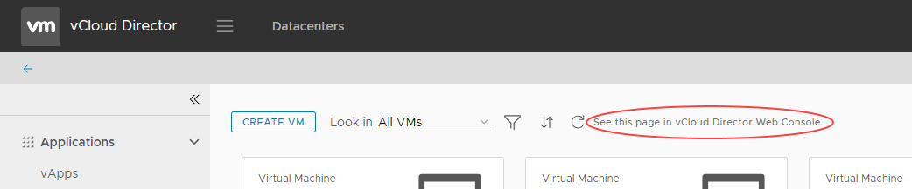

# How to switch to the vCloud Director Legacy UI

## Overview

For some tasks, you cannot use the Tenant UI; to perform these tasks, you must first switch to the Legacy UI.

Tasks that you cannot perform in the Tenant UI include:

- Editing vApp network settings

- Viewing virtual data centre (VDC) properties, such as metadata

## Switching to the Legacy UI

1. In the vCloud Director *Virtual Datacenters* dashboard, select the VDC you want to work with.

2. On the *vApps* or *Virtual Machines* page, click **See this page in vCloud Director Web Console**.

    

## Feedback

If you find an issue with this article, click **Improve this Doc** to suggest a change. If you have an idea for how we could improve any of our services, visit [UKCloud Ideas](https://ideas.ukcloud.com). Alternatively, you can contact us at <products@ukcloud.com>.
