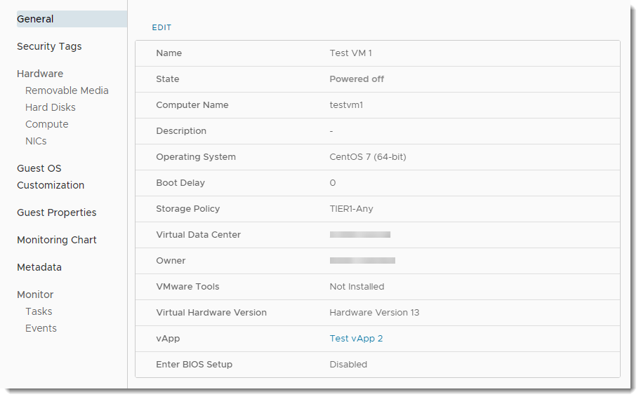
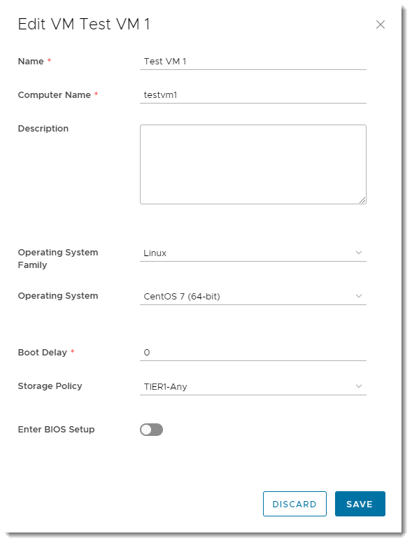
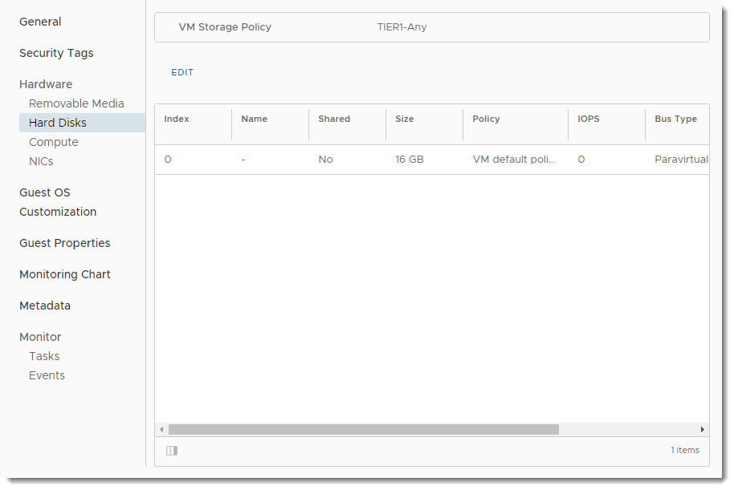
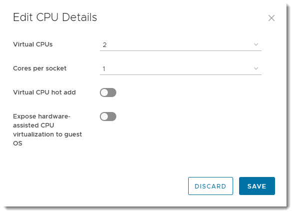
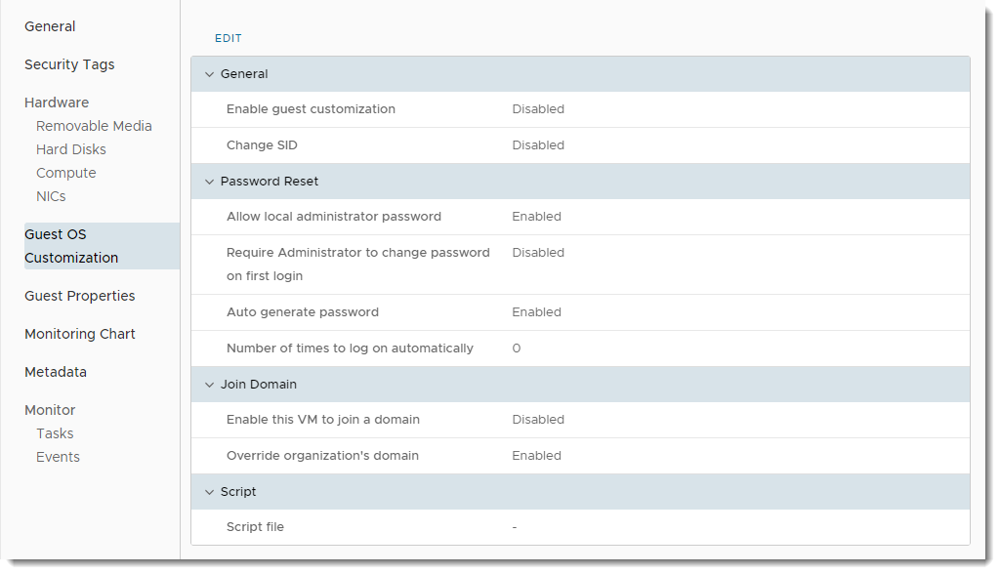

# How to view and update virtual machine settings

## Viewing and updating VM settings

After you've deployed a virtual machine (VM), you can view and update its configuration.

1. In the VMware Cloud Director *Virtual Data Center* dashboard, select the VDC that contains the VM.

2. In the left navigation panel, under *Compute*, select **Virtual Machines** to view a list of VMs within the VDC.

   

3. In the card for your VM, click **Details**.

    

4. In the left navigation panel, select each option to view the settings for the VM and change them if required. Some of the key settings are described below:

   - [*General*](#general)
   - [*Hardware*](#hardware)
   - [*Guest OS Customization*](#guest-os-customization)

## General

On the *General* page, you can view and change properties such as the VM/host name, OS type and version. You can also see if VMware Tools is installed on the VM and change the storage policy for the VM.

To update general VM settings, click **Edit**.

## Hardware

### Hard Disks

On the *Hard Disks* page, you can add or remove hard disks.

To edit hard disk properties, click **Edit**. In the *Edit Hard Disks* dialog box, click **Add** to add a hard disk to the VM. Click the delete icon (wastebasket) to remove a hard disk.

> [!WARNING]
> If you remove a hard disk, make sure you have a backup of the data. Removal of a hard disk is not reversible, and will result in the deletion of the hard disk and its data.

### Compute

On the *Compute* page, you can view and edit the CPU and memory settings of your VM.

To edit CPU settings settings, click the **Edit** link above the *CPU* section. In the *Edit CPU Details* dialog box, specify the number of vCPUs you require. You can also set the number of cores per socket, which is useful for software applications that have per-socket licensing.

To run virtualisation servers as a VM, select the **Expose hardware-assisted CPU virtualization** option. For example, you can run a Windows 2008 or 2012 server with Hyper-V or a VMware ESX host.

To edit memory settings, click the **Edit** link above the *Memory* section. In the *Edit Memory Details* dialog box, specify the amount of RAM associated with the VM.

> [!TIP]
> Make sure to select the correct units (**MB** or **GB**).

> [!TIP]
>
> - Given the flexibility of VMs, and the ability to change the number of vCPUs and amount of memory and disk space on the fly, it's often better to start small as you're not tied by the constraints of a physical server. Remember too, that more vCPUs or RAM won't necessarily make a server faster, and could cost a lot more. You need to understand how well your application can make use of multi-threading.

### NICs

On the *NICs* page, you can add or remove network adapters.

To edit network adapter settings, click **Edit**. In the *Edit NICs* dialog box, click **New** to add a network adapter. To remove a network adapter, select the radio button for the adapter and click **Delete**.

> [!NOTE]
> We recommend using the VMXNET3 network adapter where possible. The VMXNET virtual network adapter has no physical counterpart and is optimised for performance in a VM. Because operating system vendors don't provide built-in drivers for this card you must install VMware Tools to have a driver for the VMXNET network adapter available.
>
> If you want a more comprehensive guide on network adapter types, see the VMware documentation for [Network Adapter Basics](https://docs.vmware.com/en/VMware-vSphere/7.0/com.vmware.vsphere.vm_admin.doc/GUID-AF9E24A8-2CFA-447B-AC83-35D563119667.html).11. When you're done, click **OK**.

## Guest OS Customization

On the *Guest OS Customization* page, you can update guest OS customization settings.

> [!IMPORTANT]
> For guest customisation to work, VMware Tools must be installed and running in the VM.

To update guest OS customization settings, click **Edit**.

By default, a password is randomly generated and assigned when the VM is first booted. You can use this page to determine the login password, or to specify the password that will be assigned to the administrator/root user for the VM.

The password must meet the OS password complexity requirements (at least eight characters long, and including upper and lower case letters and numbers).

For Windows VMs, there is an option for guest customisation to change the SID of the operating system. Bear in mind that changing the SID can corrupt VMs running applications, such as Active Directory, that rely on a known SID.

## Related articles

For information about how to create VMs, see [*How to create a virtual machine from a template*](vmw-how-create-vm-from-template.md) or [*How to create a virtual machine from scratch*](vmw-how-create-vm-from-scratch.md).

If you haven't already, you may want to create networks to enable your VMs to communicate with each other and the outside world. For more information, see [*How to create a routed VDC network*](vmw-how-create-routed-network.md) and [*How to create an isolated VDC network*](vmw-how-create-isolated-network.md).

You may also want to create rules to enable traffic into and out of your VMs. For more information, see [*How to create firewall rules*](vmw-how-create-firewall-rules.md) and [*How to create NAT rules*](vmw-how-create-nat-rules.md).

## Feedback

If you find a problem with this article, click **Improve this Doc** to make the change yourself or raise an [issue](https://github.com/UKCloud/documentation/issues) in GitHub. If you have an idea for how we could improve any of our services, send an email to <feedback@ukcloud.com>.
