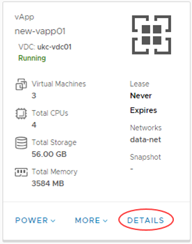
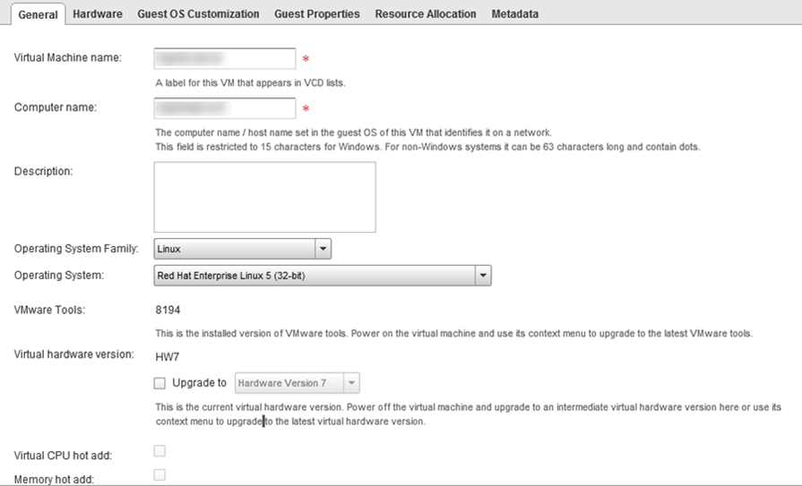
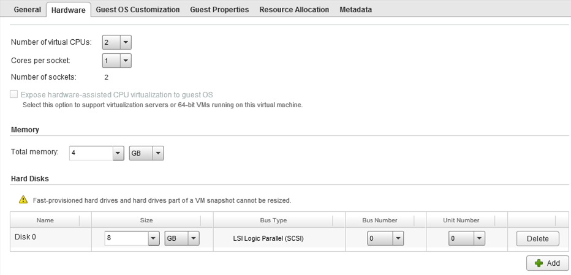
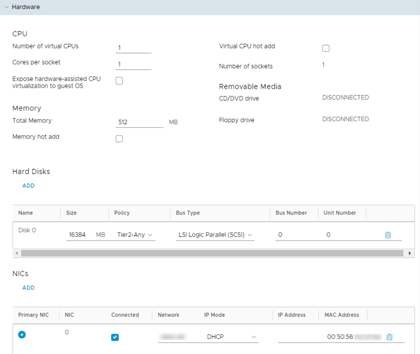
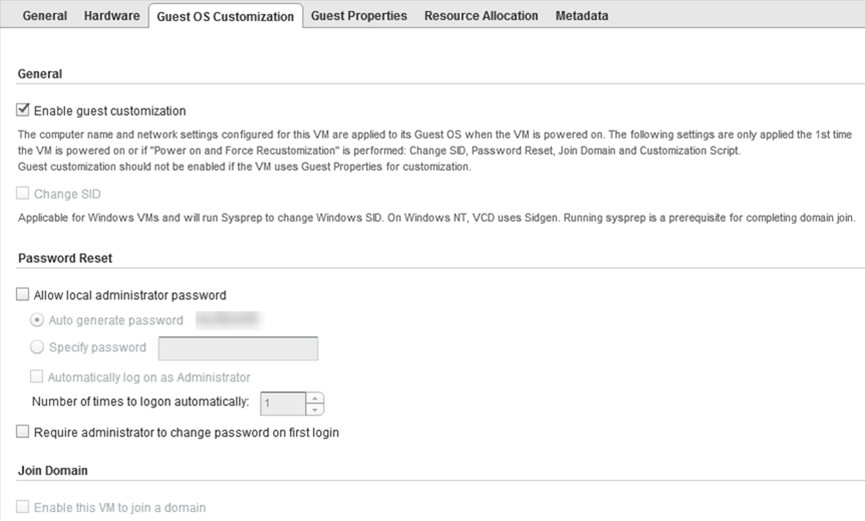
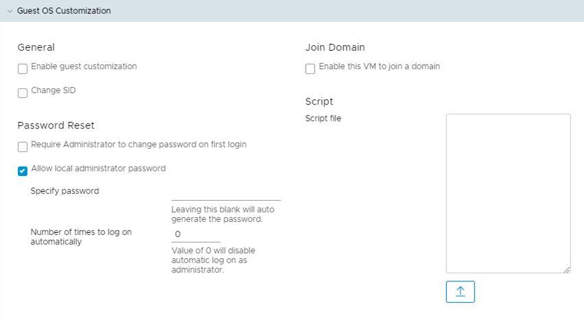
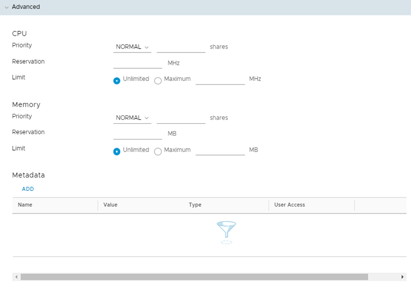

# How to view and update virtual machine settings

## Viewing and updating VM settings

After you've deployed a virtual machine (VM), you can view and update its configuration.

# [Using vCloud Director 8.20](#tab/tabid-1)

1. In vCloud Director, select the **My Cloud** tab.

    

2. Right-click the vApp that contains the VM that you want to view and select **Open**.

3. Select the **Virtual Machines** tab.

4. Right-click the VM for which you want to view configuration information and select **Properties**.

5. In the *Virtual Machine Properties* dialog box, you can select each tab to view the settings for the VM and change them if required.

6. When you're done, click **OK** to save any changes you've made, or **Cancel** to close the dialog box without saving.

# [Using vCloud Director 9.1](#tab/tabid-2)

1. In vCloud Director, click the menu icon and select **Datacenters**.

    

2. Select the VDC where the vApp that contains the VM is located.

3. In the left navigation panel, click **vApps**.

    

4. In the card for the vApp that you want to add to the catalog, click **Details**.

    

5. Click the name of the VM for which you want to view configuration information.

6. Expand each section to view the settings for the VM and change them if required.

7. When you're done, click **Save** to save any changes you've made, or **Discard Changes** to close without saving.

***

## General

View and changes properties such as the VM/host name, OS type and version. You can also see if VMware Tools is installed on the VM and change the storage policy for the VM. For more information on storage policies, see [*Storage policies*](vmw-ref-storage-policies.md).

vCloud Director 8.20 | vCloud Director 9.1
---------------------|--------------------
 | 

## Hardware

On the **Hardware** tab, you can:

- See and change the number of virtual CPUs and the amount of RAM associated with the VM.

- Specify the number of cores per socket and number of vCPUs. You can use this for software applications that have per-socket licensing. First set the number of vCPUs you require, and then set the number of cores per socket.

- Run virtualisation servers as a VM. For example, run a Windows 2008 or 2012 server with Hyper-V, or a VMware ESX host. Select the **Expose hardware-assisted CPU virtualization** check box in these cases.

- Add or remove hard disks and network adapters.

    > [!WARNING]
    > If you remove a hard disk, make sure you have a backup of the data. Removal of a hard disk is not reversible, and will result in the deletion of the hard disk and its data.

vCloud Director 8.20 | vCloud Director 9.1
---------------------|--------------------
 | 

## Guest OS Customization

By default, a password is randomly generated and assigned when the VM is first booted. You can use this tab to determine the login password, or to specify the password that will be assigned to the administrator/root user for the VM.

The password must meet the OS password complexity requirements (at least eight characters long, and including upper and lower case letters and numbers).

For guest customisation to work, VMware Tools must be installed and running in the VM.

For Windows VMs, there is an option for guest customisation to change the SID of the operating system. Bear in mind that changing the SID can corrupt VMs running applications, such as Active Directory, that rely on a known SID.

vCloud Director 8.20 | vCloud Director 9.1
---------------------|--------------------
 | 

## Advanced

You can configure CPU and memory reservation and priority for this VM. This is useful if you have a VM that needs guaranteed resources. You can also view VM metadata here.

## Feedback

If you have any comments on this document or any other aspect of your UKCloud experience, send them to <products@ukcloud.com>.