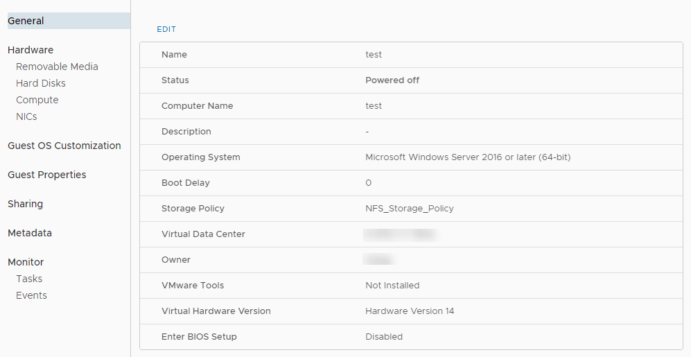
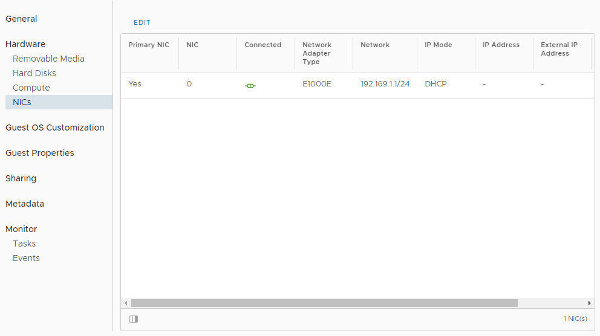

# How to view and update virtual machine settings

## Viewing and updating VM settings

After you've deployed a virtual machine (VM), you can view and update its configuration.

### [VMware Cloud Director 10.1](#tab/tabid-a)

1. In the VMware Cloud Director *Virtual Data Center* dashboard, select the VDC where the VM is located.

2. In the left navigation panel, under *Compute*, select **Virtual Machines**.

    

3. In the card for the VM, click **Details**.

    

4. Select each section to view the settings for the VM and change them if required (see below).

### [vCloud Director 9.7](#tab/tabid-b)

1. In the vCloud Director *Virtual Datacentres* dashboard, select the VDC where the vApp that contains the VM is located.

2. In the left navigation panel, click **vApps**.

    

3. In the card for the vApp that contains the VM, click **Details**.

    

4. Click the name of the VM for which you want to view configuration information.

5. Expand each section to view the settings for the VM and change them if required (see below).

6. When you're done, click **Save** to save any changes you've made, or **Discard Changes** to close without saving.

***

## General

In **General**, you can view and change properties such as the VM/host name, OS type and version. You can also see if VMware Tools is installed on the VM and change the storage policy for the VM.

### [VMware Cloud Director 10.1](#tab/tabid-a)

To update general VM settings, click **Edit**.

### [vCloud Director 9.7](#tab/tabid-b)

***

## Hardware

In **Hardware**, you can:

- See and change the number of virtual CPUs and the amount of RAM associated with the VM.

- Specify the number of cores per socket and number of vCPUs. You can use this for software applications that have per-socket licensing. First set the number of vCPUs you require, and then set the number of cores per socket.

- Run virtualisation servers as a VM. For example, run a Windows 2008 or 2012 server with Hyper-V, or a VMware ESX host. Select the **Expose hardware-assisted CPU virtualization** option in these cases.

- Add or remove hard disks and network adapters.

    > [!WARNING]
    > If you remove a hard disk, make sure you have a backup of the data. Removal of a hard disk is not reversible, and will result in the deletion of the hard disk and its data.

### [VMware Cloud Director 10.1](#tab/tabid-a)

To update VM hardware, select the appropriate component under *Hardware*, then click **Edit**.

### [vCloud Director 9.7](#tab/tabid-b)

***

## Guest OS Customization

By default, a password is randomly generated and assigned when the VM is first booted. You can use this page to determine the login password, or to specify the password that will be assigned to the administrator/root user for the VM.

The password must meet the OS password complexity requirements (at least eight characters long, and including upper and lower case letters and numbers).

For guest customisation to work, VMware Tools must be installed and running in the VM.

For Windows VMs, there is an option for guest customisation to change the SID of the operating system. Bear in mind that changing the SID can corrupt VMs running applications, such as Active Directory, that rely on a known SID.

### [VMware Cloud Director 10.1](#tab/tabid-a)

To update guest OS customisation settings, click **Edit**.

### [vCloud Director 9.7](#tab/tabid-b)

***

## Feedback

If you find a problem with this article, click **Improve this Doc** to make the change yourself or raise an [issue](https://github.com/UKCloud/documentation/issues) in GitHub. If you have an idea for how we could improve any of our services, send an email to <feedback@ukcloud.com>.
