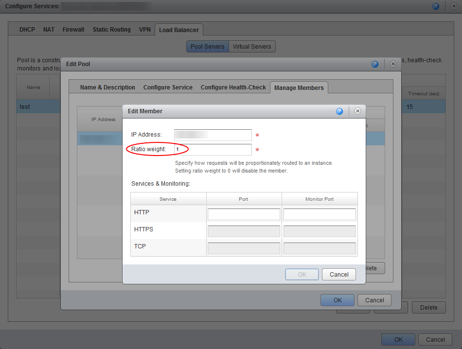
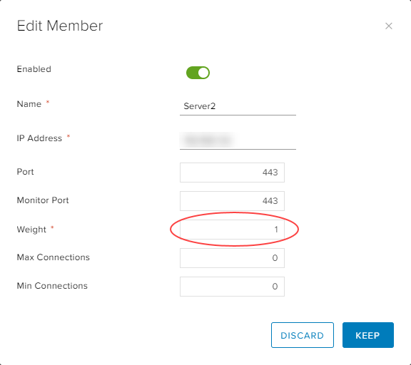

# How to upgrade your edge gateway

## Overview

This guide shows you how to check the existing version of your edge gateway and, if necessary, upgrade it to the latest available version. If you need any assistance with the upgrade process, contact the support team by raising a service request in the [My Calls](https://portal.ukcloud.com/support/my_calls) section of the UKCloud Portal.

We highly recommend that you upgrade your edge gateways to 6.2.*x* so that you can then convert them to advanced gateways. Upgrading to 6.2.*x* also fixes known issues with TcpUdp firewall rules.

> [!NOTE]
> You must upgrade all edge gateways to 6.2.*x* prior to our planned upgrade to vCloud Director 9.1.

## Intended audience

To complete the steps in this guide you must have access to the UKCloud Portal and vCloud Director.

## Prerequisites

Before you attempt to upgrade your edge gateway, check for the following.

## Check current version

To check the existing version of your edge gateway:

1. Log in to the UKCloud Portal.

    For more detailed steps, see the [*Getting Started Guide for the UKCloud Portal*](../portal/ptl-gs.md).

2. If necessary, switch to the appropriate account.

3. Click **My VMs**.

    

4. Select the compute service (vOrg) that the edge gateway belongs to.

5. Select the **My VMs** tab.

   

6. From the **Currently viewing for VDC** list, select the VDC that the edge gateway you want to check belongs to.

7. Select the **Edge Gateway** tab.

   

8. From the **Select Edge** list, select the edge gateway that you want to check.

9. The **VM version** field shows the version number of your edge gateway.

    If the version is lower than 6.2.7 (for example, 5.5.4), make a note that the edge gateway needs upgrading.

   

10. Repeat these steps for any other edge gateways that you want to check.

## Load balancers with weight of 0

In the NSX API in vCloud Director 8.20, using a load balancer weight of 0 to disable a member is no longer valid. If you attempt to upgrade an edge gateway with a load balancer member weight of 0, the redeployment will fail.

For more information, see the following VMware Knowledge Base article: <https://kb.vmware.com/s/article/51724>.

To resolve this issue, before you upgrade your edge gateway, set the load balancer member weight to 1.

# [Using vCloud Director 8.20](#tab/tabid-1)

1. In vCloud Director, select the **Administration** tab.

2. Double-click the VDC that the edge gateway that you want to edit belongs to (or right-click the VDC and select **Open**).

3. Select the **Edge Gateways** tab.

4. Right-click the edge gateway that you want to edit and select **Edge Gateway Services**.

5. Select the **Load Balancer** tab.

6. Select the load balancer you want to edit and click **Edit**.

7. Select the **Manage Members** tab.

8. Select the load balancer member that you want to edit and click **Edit**.

9. In the **Ratio** weight field, enter `1`.

   

After you've upgraded the edge gateway, we recommend that you convert it to an advanced gateway, where you can then disable the load balancer member.

> [!IMPORTANT]
> Before you convert your edge gateway, read [*How to convert your edge to an advanced gateway*](vmw-how-convert-edge.md) for important known issues relating to APIs, disabling firewalls and firewall rule keywords.

# [Using vCloud Director 9.1](#tab/tabid-2)

1. In the vCloud Director Virtual Datacenters dashboard, select the VDC that the edge gateway you want to edit belongs to.

2. In the left navigation panel, click Edges.

    

3. Select the edge that you want to configure.

4. Click the **Configure Services** button.

5. Select the **Load Balancer** tab.

6. Select the **Pools** tab.

7. Select the pool you want to edit and click the **Edit** icon.

8. In the *Members* section, select the load balancer member that you want to edit and click the **Edit** icon.

9. In the **Weight** field, enter `1`.

   

After you've upgraded the edge gateway, we recommend that you convert it to an advanced gateway, where you can then disable the load balancer member.

> [!IMPORTANT]
> Before you convert your edge gateway, read [*How to convert your edge to an advanced gateway*](vmw-how-convert-edge.md) for important known issues relating to APIs, disabling firewalls and firewall rule keywords.

***

## Upgrading your edge gateway to the latest available version

The following steps show how to upgrade your edge gateway using vCloud Director.

> [!NOTE]
> Before you begin the upgrade process, bear in mind that there will be a brief network disruption for the networks that are used by the edge gateway instance.

> [!NOTE]
> You cannot redeploy edge gateways in the new vCloud Director 9.1 tenant portal. If your environment uses vCloud Director 9.1, you must first switch to the vCloud Director web console. For more information, see [*How to switch to the vCloud Director web console from the tenant portal*](vmw-how-switch-web-console.md).

1. In vCloud Director, select the **Administration** tab.

    

2. Double-click the VDC that the edge gateway that you want to upgrade belongs to (or right-click the VDC and select **Open**).

3. Select the **Edge Gateways** tab.

    

4. Right-click the edge gateway that you want to upgrade and select **Re-Deploy**.

5. In the confirmation dialog box, click **Yes**.

    > [!IMPORTANT]
    > This step requires downtime as a new VM needs to be deployed for the edge gateway. You should make sure that you have planned for this downtime before proceeding.

6. You can monitor the status in the *Activity Task Detail* dialog box.

7. After the redeployment has finished, you can check the version of the edge gateway again in the UKCloud Portal to confirm that the upgrade has been successful.

## Next steps

We recommend that you convert your edge gateway to an advanced gateway to take advantage of more features and to access the new HTML5-based tenant portal. For more information, including known issues, see [*How to convert your edge to an advanced gateway*](vmw-how-convert-edge.md).

## Feedback

If you have any comments on this document or any other aspect of your UKCloud experience, send them to <products@ukcloud.com>.