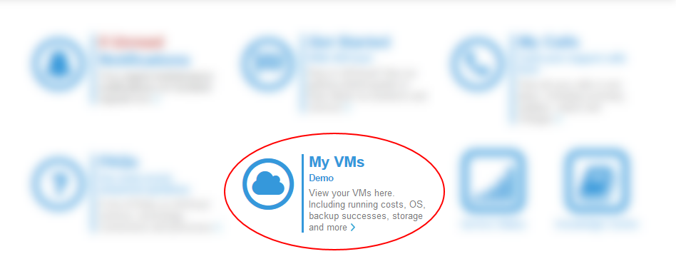

# How to upgrade your edge gateway

## Overview

This guide shows you how to check the existing version of your edge gateway and, if necessary, upgrade it to the latest available version. If you need any assistance with the upgrade process, contact the support team by raising a service request in the [My Calls](https://portal.ukcloud.com/support/my_calls) section of the UKCloud Portal.

> [!NOTE]
> In preparation for our planned upgrade to vCloud Director 9.7, you must convert your edges to advanced gateways. For more information, see [*How to convert your edge to an advanced gateway*](vmw-how-convert-edge.md).
>
> If you're already using advanced gateways, you should upgrade them to 6.4.*x*.

## Intended audience

To complete the steps in this guide you must have access to the UKCloud Portal and vCloud Director.

## Checking the current version of your edge gateway

Before you attempt to upgrade your edge gateway, check for the existing version of your edge gateway:

1. Log in to the UKCloud Portal.

    For more detailed steps, see the [*Getting Started Guide for the UKCloud Portal*](../portal/ptl-gs.md).

2. If necessary, switch to the appropriate account.

3. Click **My VMs**.

    

4. Select the compute service (vOrg) that the edge gateway belongs to.

5. Select the **My VMs** tab.

   

6. From the **Currently viewing for VDC** list, select the VDC that the edge gateway you want to check belongs to.

7. Select the **Edge Gateway** tab.

   

8. From the **Select Edge** list, select the edge gateway that you want to check.

9. The **VM version** field shows the version number of your edge gateway.

    If the version is lower than 6.4.*x* (for example, 6.2.7), make a note that the edge gateway needs upgrading.

   

10. Repeat these steps for any other edge gateways that you want to check.

## Upgrading your edge gateway to the latest available version

The following steps show how to upgrade your edge gateway using vCloud Director.

> [!IMPORTANT]
> Before you begin the upgrade process, bear in mind that this process requires downtime as a new VM needs to be deployed for the edge gateway. There will also be a brief network disruption for the networks that are used by the edge gateway instance. You should make sure that you have planned for this downtime before proceeding.

> [!NOTE]
> You cannot redeploy edge gateways in the Tenant UI for vCloud Director 9.1. If you're using vCloud Director 9.1, you must first switch to the vCloud Director Legacy UI. For more information, see [*How to switch to the vCloud Director web console from the tenant portal*](vmw-how-switch-web-console.md).

# [Using the Tenant UI](#tab/tabid-1)

1. In vCloud Director *Virtual Datacenters* dashboard, select the VDC that contains the edge gateway you want to upgrade.

2. In the left navigation panel, select **Edges**.

    

3. Select the edge that you want to configure and click **Redeploy**.

    

4. In the *Redeploy an Edge gateway* dialog box, click **OK**.

5. After the redeployment has finished, you can check the version of the edge gateway again in the UKCloud Portal to confirm that the upgrade has been successful.

# [Using the Legacy UI](#tab/tabid-2)

1. In the vCloud Director Legacy UI, select the **Administration** tab.

    

    For information about how to access the Legacy UI, see [*How to switch to the vCloud Director Legacy UI*](vmw-how-switch-web-console.md).

2. Double-click the VDC that the edge gateway that you want to upgrade belongs to (or right-click the VDC and select **Open**).

3. Select the **Edge Gateways** tab.

    

4. Right-click the edge gateway that you want to upgrade and select **Re-Deploy**.

5. In the confirmation dialog box, click **Yes**.

6. You can monitor the status in the *Activity Task Detail* dialog box.

7. After the redeployment has finished, you can check the version of the edge gateway again in the UKCloud Portal to confirm that the upgrade has been successful.

***

## Next steps

We recommend that you convert your edge gateway to an advanced gateway to take advantage of more features and to access the new HTML5-based tenant portal. For more information, including known issues, see [*How to convert your edge to an advanced gateway*](vmw-how-convert-edge.md). All edge gateways must be converted to advanced gateways before our planned upgrade to vCloud Director 9.7.

## Feedback

If you find an issue with this article, click **Improve this Doc** to suggest a change. If you have an idea for how we could improve any of our services, visit [UKCloud Ideas](https://ideas.ukcloud.com). Alternatively, you can contact us at <products@ukcloud.com>.
