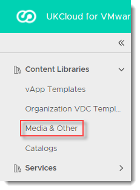
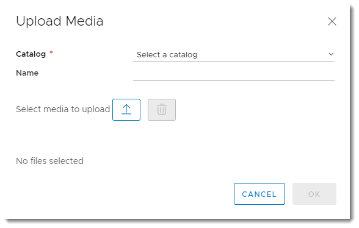

# How to upload ISO or FLP media

## Overview

You may find you need to upload ISO (DVD/CD) or FLP (floppy disk) media to vCloud that have already been provided by UKCloud. These media can then:

- Be consumed by users within your organisation

- Facilitate the creation of VMs from scratch, which can then be saved to your catalog for future deployment

## Uploading ISO or FLP media

1. In VMware Cloud Director, click the menu icon and select **Libraries**.

    

2. In the left navigation panel, click **Media & Other**.

    

3. Click **Add**.

    

4. In the *Upload Media* dialog box, select the **Catalog** to which you want to upload the media.

5. Enter a **Name** for the media if you want to use something more user-friendly than the file name.

6. Click the **Upload** icon and browse to the ISO or FLP file that you want to upload.

    

7. When you're done, click **OK**.

    You can monitor the progress of the upload in the *Recent Tasks* panel.

## Feedback

If you find a problem with this article, click **Improve this Doc** to make the change yourself or raise an [issue](https://github.com/UKCloud/documentation/issues) in GitHub. If you have an idea for how we could improve any of our services, send an email to <feedback@ukcloud.com>.
