# How to upload ISO or FLP media

## Overview

You may find you need to upload ISO (DVD/CD) or FLP (floppy disk) media to vCloud that have already been provided by UKCloud. These media can then:

- Be consumed by users within your organisation

- Facilitate the creation of VMs from scratch, which can then be saved to your catalog for future deployment

## Uploading media

If you want to upload media [from a file on your local machine](#uploading-media-from-a-local-file), you can use the Tenant UI. To upload media [from a URL](#uploading-media-from-a-url), you'll need to use the Legacy UI.

### Uploading media from a local file

1. In vCloud Director, click the menu icon and select **Libraries**.

    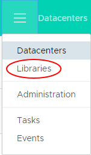

2. In the left navigation panel, click **Media & Other**.

    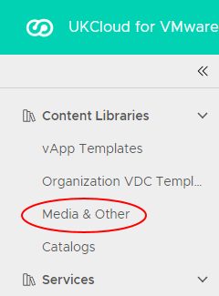

3. Click **Add**.

    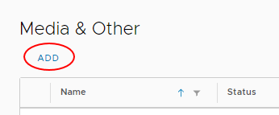

4. In the *Upload Media* dialog box, select the **Catalog** to which you want to upload the media.

    > [!TIP]
    > You can change the **Name** to be more user-friendly if necessary.

5. Click the **Upload** icon and browse to the ISO or FLP file that you want to upload.

    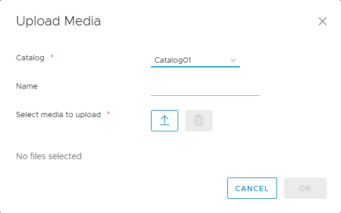

    > [!NOTE]
    > If you want to upload media from a URL, you must use the Legacy UI.

6. When you're done, click **OK**.

    In the *Media & Other* page, you can monitor the progress of the upload. You can carry on with other work while the upload takes place.

### Uploading media from a URL

1. In the vCloud Director Legacy UI, select the **Catalogs** tab.

    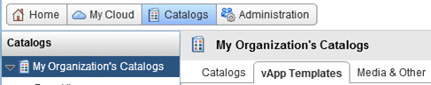

    For information about how to access the Legacy UI, see [*How to switch to the vCloud Director Legacy UI*](vmw-how-switch-web-console.md).

2. Select the **Media & Other** tab.

    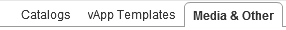

3. Click the **Upload** icon.

    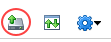

4. In the *Upload Media & Other* dialog box you can:

    - Paste in a URL for the ISO or FLP media

    - Browse to the ISO or FLP file on your local device and select it (for this to work, you need to have Java JRE available on your device)

    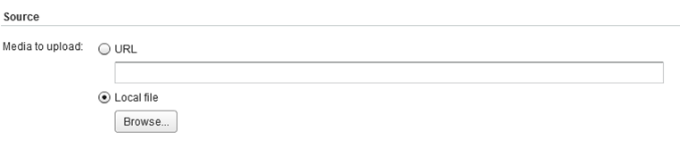

5. You can give the media a name and then choose which catalog to put it in.

    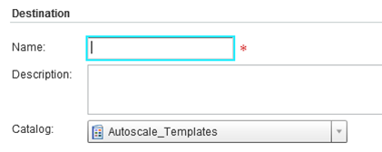

6. When you're done, click **Upload**.

    During the upload, you'll see a status window. You can carry on with other work while the upload takes place.

7. You can close (and reopen) the window by clicking the **View uploads and downloads** icon.

    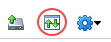

    This opens the *Transfer process* dialog box.

    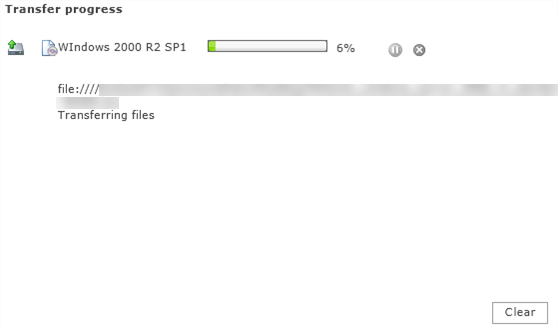

## Feedback

If you find a problem with this article, click **Improve this Doc** to make the change yourself or raise an [issue](https://github.com/UKCloud/documentation/issues) in GitHub. If you have an idea for how we could improve any of our services, send an email to <feedback@ukcloud.com>.
