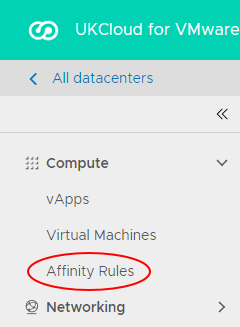

# How to use affinity and anti‑affinity rules

## Overview

Affinity and anti-affinity rules determine whether or not VMs are kept together as they are moved around within your environment.

- Affinity rules keep VMs together on the same host

- Anti-affinity rules ensure that VMs are distributed across different hosts

For example, if it is important that your application has very low latency, you can create affinity rules to make sure that the application's VMs are always kept on the same host. If you want your application to be robust in the event of host failures, you can create anti-affinity rules to spread the VMs across multiple hosts.

> [!IMPORTANT]
> Excessive use of affinity and anti-affinity rules can cause unpredictable VM and platform performance issues. For example, VMs involved in rules may have an increased likelihood of migrating between hosts simultaneously. Adding a large number of VMs to an affinity rule may cause performance issues if all of the VMs become busy simultaneously. An anti-affinity rule with a large number of VMs may not be honoured if the platform is unable to place the VMs on separate hosts.
>
> UKCloud reserves the right to disable or disregard rules if required for maintenance or platform management.

### Intended audience

To complete the steps in this guide you must have access to the UKCloud Portal and vCloud Director.

## Creating an affinity or anti-affinity rule

To create an affinity or anti-affinity rule:

### [Using the Tenant UI](#tab/tabid-1)

1. In vCloud Director, click the VDC in which you want to create the affinity or anti-affinity rule.

2. In the left navigation panel, select **Affinity Rules**.

    

3. To create an affinity rule, in the *Affinity Rules* section, click **New**.

    To create an anti-affinity rule,in the *Anti-Affinity Rules* section, click **New**.

    

4. In the *Create Affinity Rule* or *Create Anti-Affinity Rule* dialog box, enter a **Name** for the rule.

5. If you don't want the rule to take effect immediately, deselect the **Enabled** option.

    If you leave this option selected, the rule is applied and the selected VMs are redistributed as required as soon as you create the rule.

6. If you want the VMs added to the rule to be powered on if the rule cannot be met, deselect the **Required** option.

    If you leave this option selected, if the rule cannot be met, the VMs added to the rule will not power on.

7. In the *VMs in Rule* section, select the VMs that you want to add to the rule.

    

    > [!TIP]
    > Select the **Show selected** option to see a list of the VMs already included in the rule.

8. When you're done, click **Save**.

### [Using the Legacy UI](#tab/tabid-2)

1. In the vCloud Director Legacy UI, click **Administration**.

    

    For information about how to access the Legacy UI, see [*How to switch to the vCloud Director Legacy UI](vmw-how-switch-web-console.md).

2. Right-click the VDC that you want to work with and select **Open**.

3. Select the *Affinity Rules* tab.

    

4. To create an affinity rule, click the **+** icon in the *Affinity Rules* section.

    To create an anti-affinity rule, click the **+** icon in the *Anti-Affinity Rules* section.

    

5. In the *Add Affinity Rule* or *Add Anti-Affinity Rule* dialog box, enter a **Rule Name**.

6. In the search box, enter the name of a VM that you want to add to the rule.

7. Select the VM and click the **Add** button.

8. Add more VMs as required.

9. If you don't want the rule to take effect immediately, deselect the **Enabled** check box.

    You can edit the rule later to enable it when you're ready.

    

10. When you're done, click **OK**.

11. If you selected the **Enabled** check box, the affinity or anti-affinity rule is applied and the selected VMs are redistributed as required to meet the conditions of the rule.

***

## Next steps

For more information about UKCloud for VMware see the [*Getting Started Guide for UKCloud for VMware*](vmw-gs.md)

## Feedback

If you find an issue with this article, click **Improve this Doc** to suggest a change. If you have an idea for how we could improve any of our services, visit the [Ideas](https://community.ukcloud.com/ideas) section of the [UKCloud Community](https://community.ukcloud.com).
