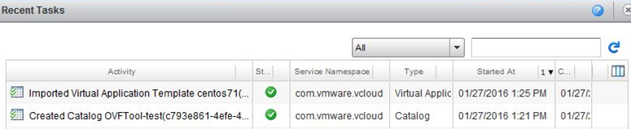
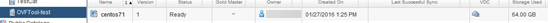
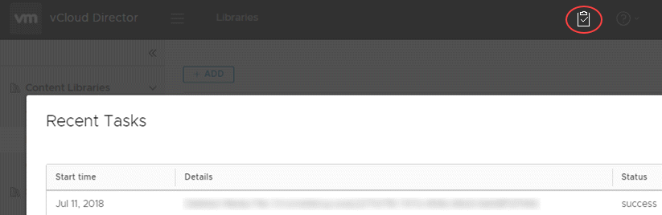
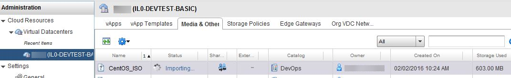
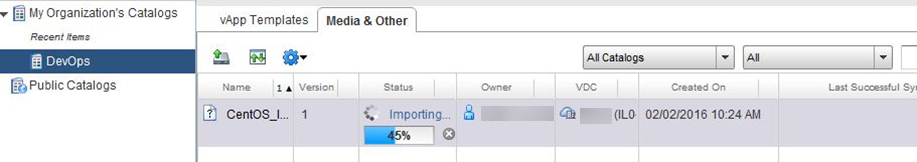
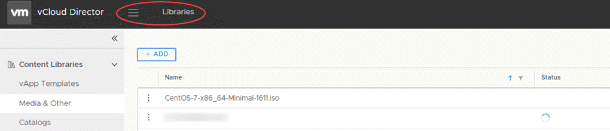

# How to use the VMware OVF Tool

## Overview

The VMware OVF Tool is a conversion program freely downloadable from VMware that assists in the distribution of virtual machines (VMs) and vApps, converting them between OVF, VMX and OVA formats. It also includes a command‑line facility to import and export OVF packages between environments or from third party suppliers. The OVF Tool is a command‑line interface (CLI) tool only.

- **OVF (Open Virtualisation Format)** is a packaging standard created by leading virtualisation vendors. It is a platform independent, efficient, open packaging and distribution format for virtual machines.

- **VMX (the VM configuration file)** is a simple text file with various parameters relating to the guest Virtual Machine.

- **The OVA file extension** is associated with Open Virtual Machine Format. Compared to the OVF file format, the OVA format contains all VM files and *.ovf files compressed into one single OVA archive file instead of many files in a folder.

## Downloading the OVF Tool

You can download the OVF Tool via the following link:

<https://my.vmware.com/group/vmware/details?downloadGroup=OVFTOOL420&productId=491>

You must have a VMware account to download the tool. You can download the OVF Tool for Windows 32-bit and 64-bit, Linux 32-bit and 64-bit, or Mac OS X.

After downloading and installing the OVF Tool, you must then go to the directory in which you installed the tool to run it. There is no icon or program logo on your desktop for the OVF Tool, so to launch it, you must use the command prompt. Go to the installation folder and run:

    ovftool

## Getting started with the OVF Tool

The OVF Tool is a CLI tool, so some level of familiarity with CMD commands helps in using the tool. There are a number of help commands, which are a good source of information:

    ovftool --help
    ovftool --help examples
    ovftool --help locators
    ovftool --help config

You can also find the OVF Tool User Guide at:

<https://www.vmware.com/support/developer/ovf/>

## Basic import and export commands

You'll mainly use the OVF Tool to import (deploy) and export VMs or appliances into and out of your UKCloud environment.

The basic syntax to do this using the OVF Tool is:

    ovftool <source> <target>

Refer to the OVF Tool User Guide for further commands and switches.

## Importing a .vmx file to a vApp template in vCloud Director

To import a `.vmx` file:

1. In your UKCloud environment, create a catalogue to contain the vApp template.

   

2. Make sure you are in the correct directory, that is, the directory containing the file you want to import.

3. Run the following command:

        ovftool --vCloudTemplate --acceptAllEulas --overwrite <filename> "vcloud://<username>@<apiURL>?org=<computeServiceID>&vappTemplate=<newTemplate>&catalog=<catalogID>"

    Where:

    - `vCloudTemplate` indicates that you're uploading a new vApp template

    - `acceptAllEulas` indicates that you accept all end user licence agreements

    - `overwrite` indicates that you're replacing an existing vApp with the new one being uploaded

    - `filename` is the name of the `.vmx` file that are importing

    - `username` is your UKCloud Portal user ID

    - `apiURL` is your vCloud Director API URL. This URL is different depending on the region in which your environment is located. For more information, see [*How to access vCloud Director through the vCloud API*](vmw-how-access-vcloud-api.md).

    - `computeServiceID` is the ID of your UKCloud compute service (sometimes also called an org or vOrg)

    - `vappTemplate` is the ID of the vApp template

    - `catalogID` is the ID of the catalog in which the vApp template is located

    For example:

          ovftool --vCloudTemplate --acceptAllEulas --overwrite centos71.vmx "vcloud://auser@api.vcd.portal.skyscapecloud.com:443?org=1-2-3-a4b56c& vappTemplate=centos71&catalog=OVFTool-test"

    > [!TIP]
    > Make sure you use double quotes (`"`) rather than single quotes (`'`).

4. The `.vmx` file is uploaded as a vApp template into your environment.

    

    

    In the vCloud Director 9.*x* HTML5 tenant portal, click the clipboard icon to see task status.

    

## Importing an .iso file to a vApp template in vCloud Director

To upload an ISO image:

1. Make sure you are in the correct directory, that is, the directory containing the ISO file you want to import.

2. Run the following command:

        ovftool -sourceType="ISO" "<path>\<filename>.iso" "vcloud://<username>@<apiURL>?vdc=<targetVDC>&org=<computeServiceID> &media=<name>&catalog=<catalogID>"

    Where:

    - `sourceType` (or `st`) indicates the type of the source file: `ISO`

    - `path\filename.iso` is the full location of the source `.iso` file you want to import

    - `username` is your UKCloud Portal user ID

    - `apiURL` is your vCloud Director API URL. This URL is different depending on the region in which your environment is located. For more information, see [*How to access vCloud Director through the vCloud API*](vmw-how-access-vcloud-api.md).

    - `targetVDC` is the VDC where you want to upload the file

    - `computeServiceID` is the ID of your UKCloud compute service (sometimes also called an org or vOrg)

    - `name` is the name to display for the file in vCloud Director

    - `catalogID` is the ID of the catalog to which you want to upload the file

    For example:

          ovftool -st="ISO" "C:\example.iso\" "vcloud://auser@api.vcd.portal.skyscapecloud.com:443?vdc=myVDC&org=1-2-3-a4b56c&media=CentOS_ISO&catalog=OVFTool-test"

    > [!TIP]
    > Make sure you use double quotes (`"`) rather than single quotes (`'`).

3. When the `ovftool` command has finished, the source and target locations are listed and then you're prompted for your username and password. When you are authenticated, the upload process is initiated.

4. The following example shows an upload in progress on the UKCloud target VDC.

    

6. The next example shows an upload in progress on the UKCloud target catalog under the **Media & Other** tab.

    

7. In the vCloud Director 9.*x* HTML5 tenant portal, you will see this under **Libraries**.

    

## Feedback

If you find an issue with this article, click **Improve this Doc** to suggest a change. If you have an idea for how we could improve any of our services, visit [UKCloud Ideas](https://ideas.ukcloud.com). Alternatively, you can contact us at <products@ukcloud.com>.