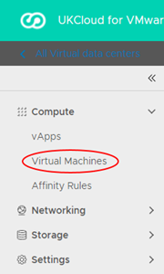

# How to use VM location

## Overview

The VM location function in VMware Cloud Director enables you to identify where a specific virtual machine (VM) in your organisation is located within the UKCloud platform.

This article describes the step-by-step instructions for obtaining this information, which is available for VMs in both the Assured OFFICIAL and Elevated OFFICIAL security domains.

With regards to the supplied location, this is standardised to the following options:

- Corsham (located in the Corsham data centre)

- Farnborough (located in the Farnborough data centre)

- ENHANCED-Corsham (replicated in both data centres; active in Corsham and standby in Farnborough)

- ENHANCED-Farnborough (replicated in both data centres; active in Farnborough and standby in Corsham)

This feature is designed to show the location of VMs to assist you in optimising your infrastructure with regard to performance and availability. If you want to change the location of a specific or group of VMs, raise a Service Request from the [My Calls](https://portal.skyscapecloud.com/support/ivanti) section of the UKCloud Portal.

You can also use the [vCloud API](#obtaining-the-location-of-a-specific-vm-using-the-vcloud-api).

## Obtaining the location of a VM

1. In the VMware Cloud Director *Virtual Data Center* dashboard, select the VDC in which your VM is located.

2. In the left navigation panel, select **Virtual Machines**.

    

3. In the card for the VM, click **Details**.

    

4. Select **Metadata**.

    

5. The location of the VM is displayed in the **Value** column for the **SkyscapeLocation** metadata tag.

## Obtaining the location of a specific VM using the vCloud API

You can also obtain the location of a VM via the via the API, looking at the metadata against the applicable VM.

The following has been created as an example script to obtain the VM location:

`https://vcd.portal.skyscapecloud.com/api/vApp/vm-xxx/metadata`

Replace the `xxx` with the relevant VM ID.

## Feedback

If you find a problem with this article, click **Improve this Doc** to make the change yourself or raise an [issue](https://github.com/UKCloud/documentation/issues) in GitHub. If you have an idea for how we could improve any of our services, send an email to <feedback@ukcloud.com>.
