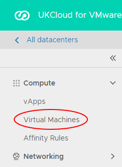
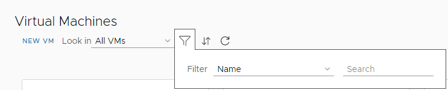
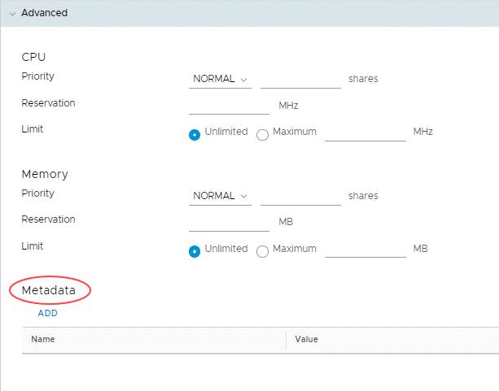

# How to use VM location in vCloud Director

## Overview

The VM location function in vCloud Director enables you to identify where a specific virtual machine (VM) within your organisation is located within the UKCloud platform.

This article describes the step-by-step instructions for obtaining this information which is available for VMs in both the Assured OFFICIAL and Elevated OFFICIAL platforms.

With regards to the supplied location, this is standardised to the following options:

- Corsham (located in the Corsham data centre)

- Farnborough (located in the Farnborough data centre)

- ENHANCED-Corsham (replicated in both data centres. Active in Corsham and standby in Farnborough)

- ENHANCED-Farnborough (replicated in both data centres. Active in Farnborough and standby in Corsham)

This feature is designed to show the location of VMs to assist you in optimising your infrastructure with regard to performance and availability. If you wish to change the location of a specific or group of VMs, raise a support request from the [My Calls](https://portal.skyscapecloud.com/support/ivanti) section of the UKCloud Portal.

You can also use the [vCloud API](#obtaining-the-location-of-a-specific-vm-using-the-vcloud-api).

## Obtaining the location of a VM

1. In the vCloud Director *Virtual Datacenters* dashboard, select the **VDC** your VM is in.

2. In the left navigation panel, select **Virtual Machines**.

    

    For more detailed instructions on accessing vCloud Director, see the [*Getting Started Guide for UKCloud for VMware*](vmw-gs.md)

    > [!TIP]
    > You can change the view from cards to list. If you need to search for the VM, click on the filter icon and enter the name of the VM.
    > 
    > 

3. In the card for the VM, click **Details**.

4. Expand the *Advanced* section of the VM details to see *Metadata* information at the bottom.

    

    The location of the VM is displayed in the **Value** column.

## Obtaining the location of a specific VM using the vCloud API

You can also obtain the location of a VM via the via the API, looking at the metadata against the applicable VM.

The following has been created as an example script to obtain the VM location:

https://api.vcd.portal.ukcloud.com/api/vApp/vm-xxxxxxxx/metadata

Replace the "xxxxxxxx" with the relevant VM ID.

## Feedback

If you find an issue with this article, click **Improve this Doc** to suggest a change. If you have an idea for how we could improve any of our services, visit the [Ideas](https://community.ukcloud.com/ideas) section of the [UKCloud Community](https://community.ukcloud.com).
