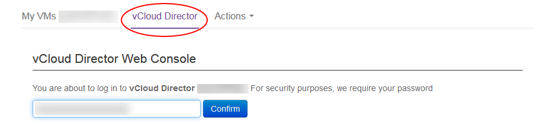
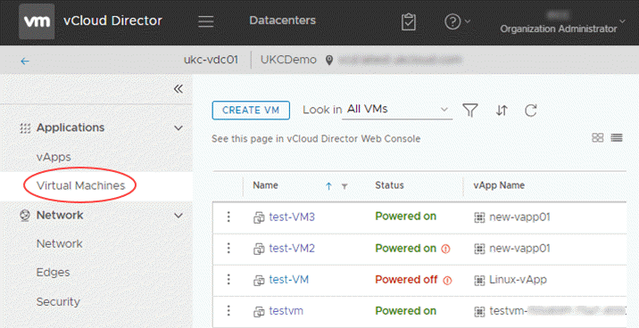
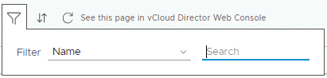
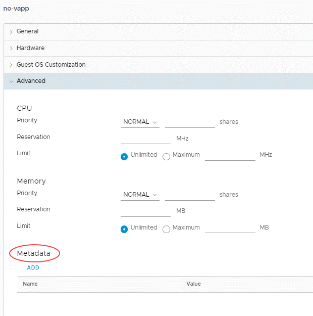
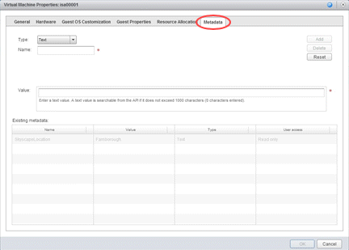

# How to use VM location in vCloud Director

## Overview

The VM location function, now available within vCloud Director, enables you to identify where a specific virtual machine (VM) within your organisation is located within the UKCloud platform.

This guide describes the step-by-step instructions for obtaining this information which is available for VMs in both the Assured OFFICIAL and Elevated OFFICIAL platforms.

With regards to the supplied location, this is standardised to the following options:

- Corsham (located in the Corsham data centre)
- Farnborough (located in the Farnborough data centre)
- ENHANCED-Corsham (replicated in both data centres. Active in Corsham and standby in Farnborough)
- ENHANCED-Farnborough (replicated in both data centres. Active in Farnborough and standby in Corsham)

This feature is designed to show the location of VMs to assist you in optimising your infrastructure with regard to performance and availability. If you wish to change the location of a specific or group
of VMs, please raise a support request from the "My Calls" section of the UKCloud Portal.

## How to obtain the location of a specific VM via the Portal

### Using the HTML5 tenant portal in vCloud Director 9.1

1. Login to the UKCloud Portal.

    For more detailed steps, see the [*Getting Started Guide for the UKCloud Portal*](../portal/ptl-gs.md).

2. If necessary, switch to the appropriate account.

3. In the Portal navigation panel expand **VMware Cloud** then select your compute service.

    

4. On the **vCloud Director** tab, enter your UKCloud Portal password and then click **Confirm**.

    

5. Select the **VDC** your VM is in and select **Virtual Machines**.

    

    You can change the view from cards or list. If you need to search for the VM, click on the filter icon and enter the name of the VM.

    

6. Click the VM **Name** to view details about location.

7. Expand the **Advanced** section of VM properties to see *Metadata* information at the bottom.

    

    The location of the VM is displayed in the **Value** column.

### Using the Flex-based UI in vCloud Director 8.20

1. In vCloud Director, click the **Administration** tab.

    

    For more detailed instructions, see the [*Getting Started Guide for UKCloud for VMware*](vmw-gs.md)

2. Select the VM you want to find the location of.

    

3. Right click your VM and select **Properties**.

4. Select the **Metadata** tab.

    

    The location of the VM is displayed in the **Value** column.

## How to obtain the location of a specific VM via the API

You can also obtain the location of a VM via the via the API, looking at the metadata against the applicable VM.

The following has been created as an example script to obtain the VM location:

https://api.vcd.portal.ukcloud.com/api/vApp/vm-xxxxxxxx/metadata

Replace the "xxxxxxxx" with the relevant VM ID.

## Feedback

If you have any comments on this document or any other aspect of your UKCloud experience, send them to <products@ukcloud.com>.