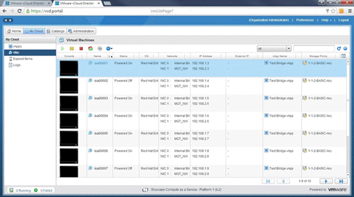

# How to use VM location in vCloud Director

## Overview

The VM location function, now available within vCloud Director, enables you to identify where a specific virtual machine (VM) within your organisation is located within the UKCloud platform.

This guide describes the step-by-step instructions for obtaining this information which is available for VMs in both the Assured OFFICIAL and Elevated OFFICIAL platforms.

With regards to the supplied location, this is standardised to the following options:

- Corsham (located in the Corsham data centre)

- Farnborough (located in the Farnborough data centre)

- ENHANCED-Corsham (replicated in both data centres. Active in Corsham and standby in Farnborough)

- ENHANCED-Farnborough (replicated in both data centres. Active in Farnborough and standby in Corsham)

This feature is designed to show the location of VMs to assist you in optimising your infrastructure with regard to performance and availability. If you wish to change the location of a specific or group
of VMs, please raise a support request from the "My Calls" section of the UKCloud Portal.

The steps for using VM location depend on the version of vCloud Director available in your environment:

- [vCloud Director 8.20](#obtaining-the-location-of-a-specific-vm-vcloud-director-820)

- [vCloud Director 9.1](#obtaining-the-location-of-a-specific-vm-vcloud-director-91)

You can also use the [vCloud API](#obtaining-the-location-of-a-specific-vm-vcloud-api).

## Obtaining the location of a specific VM (vCloud Director 8.20)

1. In vCloud Director, click the **Administration** tab.

    

    For more detailed instructions on accessing vCloud Director, see the [*Getting Started Guide for UKCloud for VMware*](vmw-gs.md)

2. Select the VM you want to find the location of.

    

3. Right click your VM and select **Properties**.

4. Select the **Metadata** tab.

    

    The location of the VM is displayed in the **Value** column.

## Obtaining the location of a specific VM (vCloud Director 9.1)

1. In vCloud Director, select the **VDC** your VM is in then select **Virtual Machines**.

    

    For more detailed instructions on accessing vCloud Director, see the [*Getting Started Guide for UKCloud for VMware*](vmw-gs.md)

    > [!TIP]
    > You can change the view from cards or list. If you need to search for the VM, click on the filter icon and enter the name of the VM.

    

2. In the card for the VM, click **Details**.

3. Expand the **Advanced** section of the VM details to see *Metadata* information at the bottom.

    

    The location of the VM is displayed in the **Value** column.

## Obtaining the location of a specific VM (vCloud API)

You can also obtain the location of a VM via the via the API, looking at the metadata against the applicable VM.

The following has been created as an example script to obtain the VM location:

https://api.vcd.portal.ukcloud.com/api/vApp/vm-xxxxxxxx/metadata

Replace the "xxxxxxxx" with the relevant VM ID.

## Feedback

If you have any comments on this document or any other aspect of your UKCloud experience, send them to <products@ukcloud.com>.