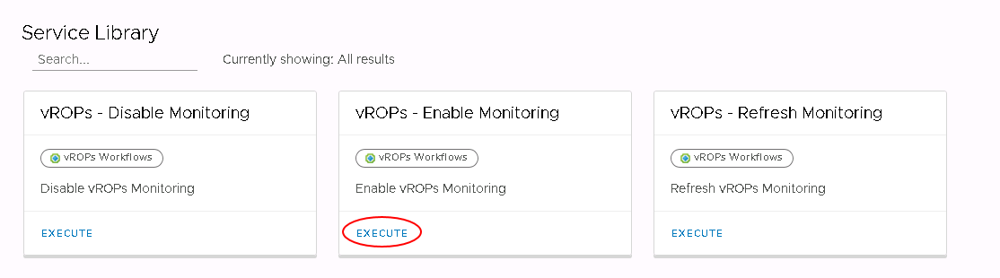
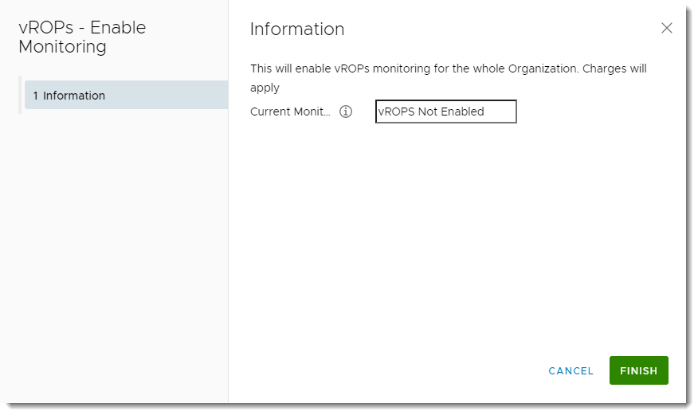
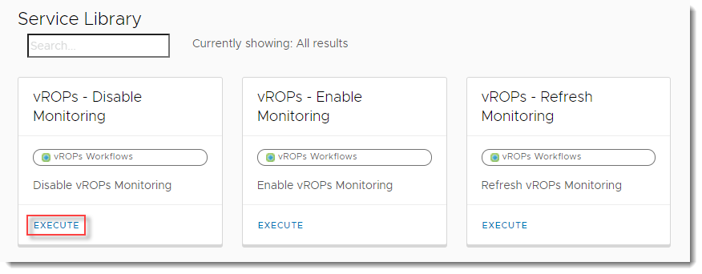

# How to enable the vRealize Operations Tenant Appliance to access advanced monitoring

## Overview

UKCloud for VMware provides advanced monitoring, powered by the vRealize Operations (vROps) Tenant Appliance, as part of its Advanced Management bundle (additional charges apply). Using advanced monitoring, you can view metrics and reports relating to your UKCloud for VMware environment.

Advanced monitoring enables you to:

- Monitor and manage workloads - Over 400 different metrics available for CPU, memory and storage

- Identify workload optimisation options - Use analytics displaying the overall health of the platform to optimise your workloads

- Rightsize your VMs - Identify if your VMs can be resized to reduce costs or improve performance

- View optimisation history - Identify issues over a given time frame and make adjustments as necessary

### Intended audience

To enable the vRealize Operations Tenant Appliance, you must be a vCloud Director/VMware Cloud Director Organization Administrator.

## Enabling the vRealize Operations Tenant Appliance

> [!NOTE]
> When you enable the vRealize Operations Tenant Appliance, the Advanced Management bundle is added to the account. This applies across the whole VDC organisation and will result in an uplift to the hourly VM cost across all VMs in the organisation. For more information, see the [UKCloud Pricing Guide](https://ukcloud.com/pricing-guide).

To make advanced monitoring available for your UKCloud for VMware environment, you need to enable the vRealize Operations Tenant Appliance:

1. In the vCloud Director/VMware Cloud Director menu, select **Libraries**.

    > [!TIP] In vCloud Director 9.7, click the menu icon (three lines) to access the menu.

2. In the left navigation panel, under *Services*, select **Service Library**.

3. In the *vROps - Enable Monitoring* card, click **Execute**.

    

4. In the *vROps - Enable Monitoring* dialog box, click **Finish**.

    

5. You can monitor the progress in the *Recent Tasks* panel.

## Disabling the vRealize Operations Tenant Appliance

If you no longer want access to advanced monitoring, you must disable the vRealize Operations Tenant Appliance:

1. In the vCloud Director/VMware Cloud Director menu, select **Libraries**.

    > [!TIP] In vCloud Director 9.7, click the menu icon (three lines) to access the menu.

2. In the left navigation panel, under *Services*, select **Service Library**.

3. In the *vROps - Disable Monitoring* card, click **Execute**.

    

4. In the *vROps - Disable Monitoring* dialog box, click **Finish**.

5. You can monitor the progress in the *Recent Tasks* panel.

## Next steps

After you've enabled the vRealize Operations Tenant Appliance, you can start to access metrics and reports through the *Operations Manager*. For more information, see [*How to access advanced monitoring using the vRealize Operations Tenant Appliance*](vmw-how-vrops-use.md).

The UKCloud for VMware Advanced Management bundle also includes advanced networking options. For more information, see [*Advanced networking options for UKCloud for VMware*](vmw-ref-advanced-networking.md).

## Feedback

If you find a problem with this article, click **Improve this Doc** to make the change yourself or raise an [issue](https://github.com/UKCloud/documentation/issues) in GitHub. If you have an idea for how we could improve any of our services, send an email to <feedback@ukcloud.com>.
