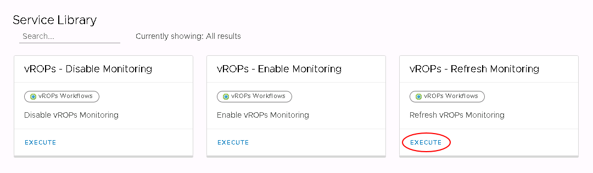
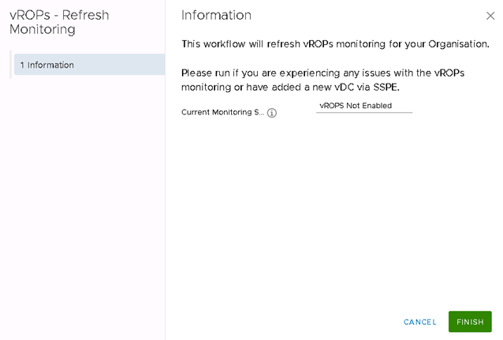

#### UKCloud Limited (“UKC”) and Virtual Infrastructure Group Limited (“VIG”) (together “the Companies”) – in Compulsory Liquidation

On 25 October 2022, the Companies were placed into Liquidation with the Official Receiver appointed as Liquidator and J Robinson and A M Hudson simultaneously appointed as Special Managers to manage the liquidation process on behalf of the Official Receiver.

Further information regarding the Liquidations can be found here: <https://www.gov.uk/government/news/virtual-infrastructure-group-limited-and-ukcloud-limited-information-for-creditors-and-interested-parties>

Contact details: 
For any general queries relating to the Liquidations please email <ukcloud@uk.ey.com> 
For customer related queries please email <ukcloudcustomers@uk.ey.com> 
For supplier related queries please email <ukcloudsuppliers@uk.ey.com>

# How to refresh the vRealize Operations Tenant Appliance in your UKCloud for VMware environment

## Overview

If a user uses the Portal GUI or API to add a new VDC to a compute service after the vRealize Operations (vROps) Tenant Appliance has been enabled, you must refresh the Tenant Appliance to include the new VDC in the metrics.

### Intended audience

To refresh the vRealize Operations Tenant Appliance, you must be a VMware Cloud Director Organization Administrator.

## Refreshing the vRealize Operations Tenant Appliance

1. In VMware Cloud Director, in the top menu, select **Libraries**.

    

2. In the left navigation panel, under *Services*, select **Service Library**.

   

3. In the *vROps - Refresh Monitoring* card, click **Execute**.

    

4. In the *vROps - Refresh Monitoring* dialog box, click **Finish**.

    

5. You can monitor the progress in the *Recent Tasks* panel.

## Next steps

For information about accessing monitoring metrics and reports through the *Operations Manager*, see [*How to access advanced monitoring using the vRealize Operations Tenant Appliance*](vmw-how-vrops-use.md).

## Feedback

If you find a problem with this article, click **Improve this Doc** to make the change yourself or raise an [issue](https://github.com/UKCloud/documentation/issues) in GitHub. If you have an idea for how we could improve any of our services, send an email to <feedback@ukcloud.com>.
