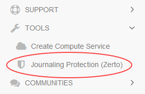
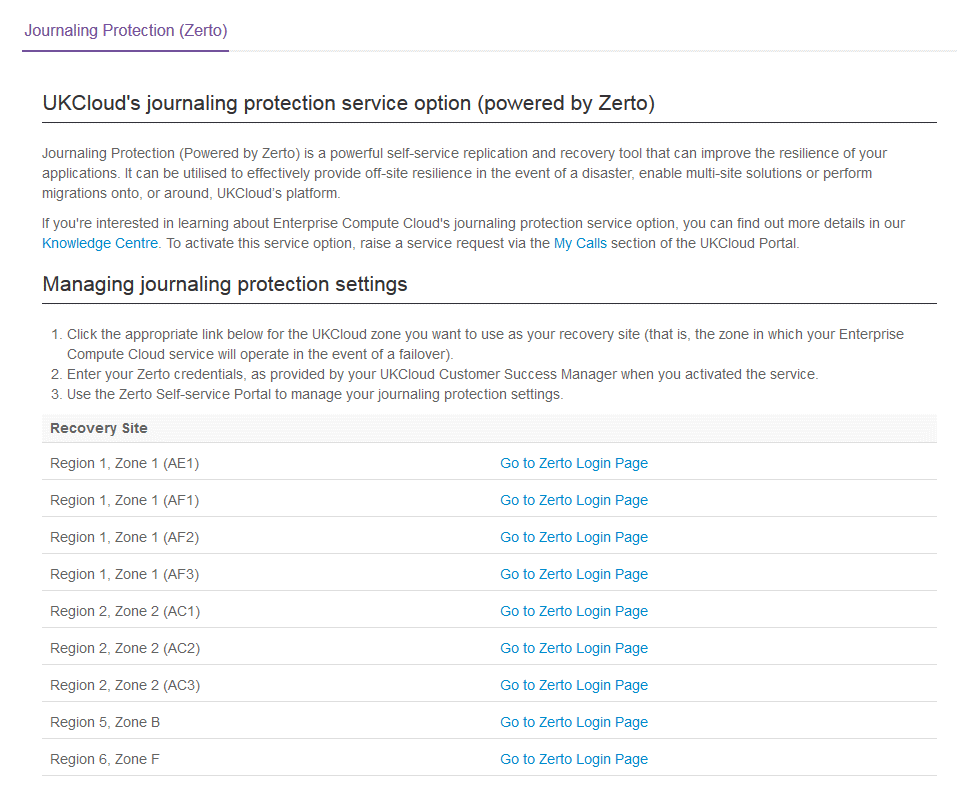

# How to access the Zerto Self-Service Portal

## Overview

UKCloud uses Zerto to power the following services:

- Disaster Recovery to the Cloud

- Journaling Protection for UKCloud for VMware

- Workload Migration from a local, on-premises environment to the UKCloud platform

The Zerto Self-Service Portal (ZSSP) provides access to all the tools you need to:

- Create and manage virtual protection groups (VPGs) for Journaling Protection

- Perform test and live failovers

- Move VPGs to migrate workloads from your local environment to the UKCloud platform

### Intended audience

To complete the steps in this guide you must have log in details for the appropriate ZSSP.

## Which Zerto Self-Service Portal should I use?

The ZSSP you use depends on what you are trying to do:

- To create a VPG for Journaling Protection, use the ZSSP in the zone where the VMs you are protecting are located

    > [!NOTE]
    > To create a VPG for Disaster Recovery to the Cloud or Workload Migration, use the Zerto Virtual Manager (ZVM) Web Client in your local environment. For the latest version of ZVM, contact UKCloud Customer Support.

- To perform a test or live failover for Disaster Recovery to the Cloud, Journaling Protection or Workload Migration, use the ZSSP in the zone where your target VDC (for recovery or migration) is located

- To move a VPG for Workload Migration, use the ZSSP in the UKCloud zone where your target VDC is located

## Accessing the Zerto Self-Service Portal

If you want to create a VPG for Journaling Protection, run a test or live failover, or move a VPG, access the ZSSP in the appropriate UKCloud zone.

> [!NOTE]
> If you want to create a VPG for Disaster Recovery to the Cloud or Workload Migration, use the ZVM Web Client in your local environment.

1. Log in to the UKCloud Portal.

    For detailed instructions, see the [*Getting Started Guide for the UKCloud Portal*](../portal/ptl-gs.md).

2. In the navigation panel, expand **TOOLS** and then select **Journaling Protection (Zerto)**.

    

3. On the *Journaling Protection (Zerto)* page, click the **Go to Zerto Login Page** link for the appropriate UKCloud zone (for more information, see [*Which Zerto Self-Service Portal should I use?*](#which-zerto-self-service-portal-should-i-use)).

    

4. Enter your log in credentials, including your **ZORG** name.

    

    > [!NOTE]
    > These credentials are different from the ones you use to log in to the UKCloud Portal. If you're not sure what they are, raise a Service Request through [My Calls](https://portal.skyscapecloud.com/support/ivanti).

5. After you log in, you'll see the main ZSSP page.

    

## Next steps

After you have logged in to the ZSSP, you can:

- Create and manage VPGs to identify the VMs that you want to protect (see [*How to create a virtual protection group*](vmw-how-zerto-create-vpg.md))

- Perform a test failover to verify that your VMs will be recovered correctly in the event of a disaster (see [*How to perform a failover*](vmw-how-zerto-perform-failover.md))

- Perform a live failover to recover after a disaster or migrate workloads (see [*How to perform a failover*](vmw-how-zerto-perform-failover.md))

- Move a VPG to migrate workloads (see [*How to migrate your workloads to the UKCloud platform*](../migration/migr-how-zerto-migrate-to-ukcloud.md))

## Feedback

If you find a problem with this article, click **Improve this Doc** to make the change yourself or raise an [issue](https://github.com/UKCloud/documentation/issues) in GitHub. If you have an idea for how we could improve any of our services, send an email to <feedback@ukcloud.com>.
