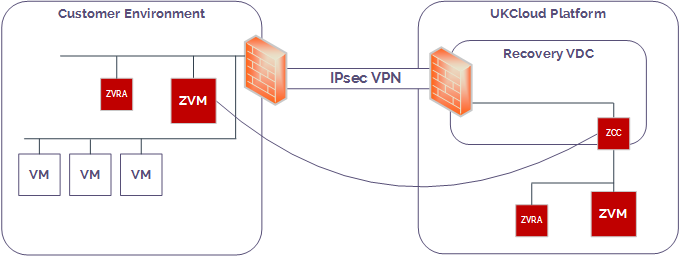

# How to install and configure Zerto in your local environment

## Overview

If you want to use UKCloud's Disaster Recovery as a Service or Migration to the Cloud services, there are some tasks that you must perform to prepare your local environment.

- UKCloud's Disaster Recovery as a Service enables you to provide a secure, scalable disaster recovery solution for your on-premises environment by replicating your workloads on the UKCloud platform

- Migration to the Cloud enables you to move your workloads from a local, on-premises environment onto the UKCloud platform.

Our Disaster Recovery as a Service and Migration to the Cloud services are powered by Zerto, a leading provider of disaster recovery software for the cloud, so you'll need to install Zerto software in your local environment to enable the replication of your workloads to the UKCloud platform. You'll also need to create a IPsec VPN to connect your local environment to the UKCloud.

   

### Intended audience

To complete the steps in this guide, you must have administrator access to the vCenter Server that hosts the VMs that you want to protect or migrate.

## Before you begin

When you raise a Service Request for Disaster Recovery as a Service or Migration to the Cloud, UKCloud provides you with:

- A ZORG ID to identify your environment within Zerto

- A link to the appropriate version of Zerto Virtual Manager (ZVM) for you to deploy in your local environment as well as a site address and port for licensing purposes

- The IP address (from the IP range you provided to UKCloud) of the Zerto Cloud Connector (ZCC) deployed in your target VDC (for recovery or migration); you'll need this to complete the setup of the site-to-site VPN between your local environment and your target VDC

- Access to the Zerto Self-Service Portal (ZSSP) in the UKCloud zone where your target VDC is located

## Installing and configuring Zerto Virtual Manager in your local environment

As UKCloud's Disaster Recovery as a Service and  Migration to the Cloud services are powered by Zerto, you need to set up Zerto Virtual Manager (ZVM) in your local environment to enable your VMs to be replicated on the UKCloud platform. ZVM is responsible for all the Zerto configuration for a site and performs the replication tasks.

UKCloud provides a version of ZVM that is compatible with the Zerto software on the UKCloud platform.

1. Download and run the executable file from the link provided by UKCloud.

    > [!NOTE]
    > Install ZVM on a Windows 2008r2 or 2012r2 server, ideally with nothing else running on it.

2. On the *Welcome* page of the *Zerto Virtual Replication Installation for VMware vSphere* wizard, read the information provided then click **NEXT**.

3. On the *License Agreement* page, accept the agreement and then click **NEXT**.

4. On the *Select Installation Folder/Directory* page, change the location if necessary and then click **NEXT**.

5. On the *Choose Installation Type* page, select **Express installation** and then click **NEXT**.

6. On the *vCenter Server Connectivity* page, in the **IP / Host Name** field, enter the address of the vCenter Server that hosts the VMs that you want to protect or migrate.

7. In the **Username** and **Password** fields, enter the administrator credentials for the vCenter Server.

8. In the **Site Name** field, enter a name to identify the location of this installation of ZVM and then click **NEXT**.

9. On the *Validation* page, fix any issues if necessary and then click **RUN**.

10. After ZVM has finished installing, on the *Install Complete* page, select the **Open the Zerto Virtual Manager interface** checkbox and then click **DONE**.

11. Log in to the Virtual Manager Web Client using your vCenter Server administrator credentials.

12. The first time you log in, you'll need to enter licensing details.

    As you are using ZVM as part of a UKCloud service, select **Pair to a site with a license** and enter the **Site Address** and **Port**     provided by UKCloud.

13. Click **START**.

14. In ZVM, select the **SETUP** tab.

15. Click **NEW VRA**.

    The Virtual Replication Appliance (VRA) manages the replication of VMs across the two sites.

16. In the *Configure and Install VRA* dialog, from the **Host** list, select the IP address of the server that hosts the VMs that you want to protect or migrate.

17. In the **Host Root Password** field, enter the root password of the VM host server.

18. Complete the other fields in the *Host Details* section as required.

19. In the *VRA Network Details* section, enter a static IP address and the gateway details of the network for the VRA to use.

20. Click **Install**.

21. After the VRA has finished installing, you should be able to see your new VRA in the **SETUP** tab.

## Creating a VPN between your local environment and UKCloud

As you'll be replicating your VMs from your local environment onto the UKCloud platform, you need to create a secure connection between the two sites. You can do this by creating a site-to-site VPN.

For information about how to create a site-to-site VPN, see [*How to configure IPsec VPN*](vmw-how-configure-ipsec-vpn.md).

The following table lists the minimum firewall rules required for Zerto to pair and replicate with the UKCloud platform.

Source device | Target service | Port | Direction | Purpose
--------------|----------------|------|-----------|---------
Customer ZVM | Service Provider ZCC | TCP 9081 | Bi-directional | ZVM to ZCC communication
Customer VRA | Service Provider ZCC | TCP 4007, 9082 and up^ | Bi-directional | TCP control communication between source and target VRAs and ZCC
Customer VRA | Service Provider ZCC | TCP 4008, 9082 and up^ | Bi-directional | TCP communication to pass data between source and target VRAs and ZCC

^ We recommend that you use ports 9082 to 9200 to allow for increase in VRA on source and target sites

## Next steps

Now that you have prepared your local environment for Disaster Recovery as a Service or  Migration to the Cloud, you can create a virtual protection group (VPG) to identify the VMs that you want to protect or migrate. For more information, see [*How to create a virtual protection group*](vmw-how-zerto-create-vpg.md).

## Feedback

If you find an issue with this article, click **Improve this Doc** to suggest a change. If you have an idea for how we could improve any of our services, visit [UKCloud Ideas](https://ideas.ukcloud.com). Alternatively, you can contact us at <products@ukcloud.com>.
