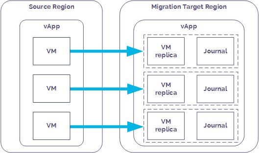
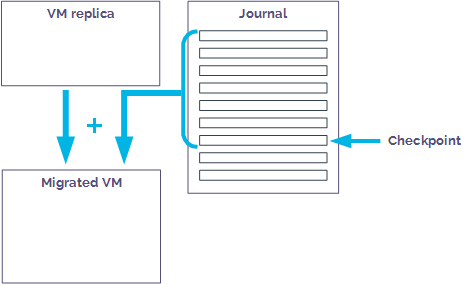
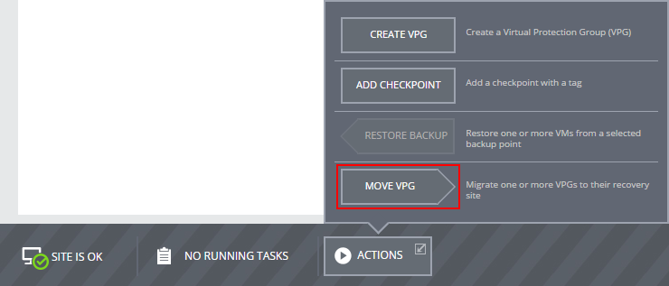
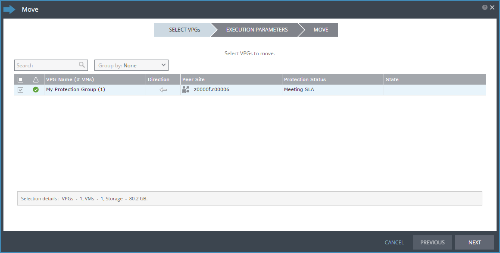
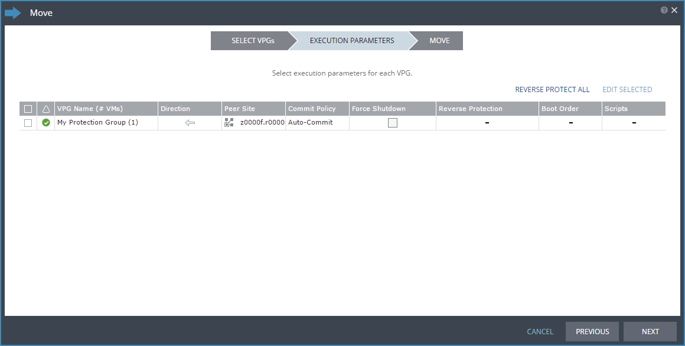

# How to migrate your workloads between UKCloud regions

## Overview

Journaling Protection is a powerful, self-service replication and recovery tool that can help you improve your organisational resilience. However, you can also use UKCloud's Journaling Protection solution to migrate your UKCloud for VMware applications into another UKCloud for VMware-enabled zone. This enables you to move your workloads into the regions within the UKCloud platform that are best suited for their requirements.

Our Migration service is powered by Zerto, a leading provider of disaster recovery software for the cloud.

The migration of VMs within the UKCloud platform is very closely aligned to the disaster recovery of VMs within UKCloud; the small difference being that when you have failed-over the VMs from one region into another, you don't then failback to your primary region. As such, you'll find that the articles linked to from this article refer to disaster recovery and failover, however the steps also apply to migration.

### Intended audience

To complete the steps in this guide, you need to have access to the Zerto Self-Service Portal.

## Before you begin

When you request Journaling Protection to migrate a workload within the UKCloud platform, UKCloud provides you with:

- A ZORG ID to identify your environment within Zerto
- Access to the Zerto Self-Service Portal (ZSSP), where you can create and manage your VPGs

You should consider the following:

- Migration is provided on a vApp basis (not for individual VMs). This is worth considering if you intend to migrate only some parts of your vApps.
- VMs must be powered on to be synchronised prior to migration.
- Our Journaling Protection service option captures every action. When a VM is deleted from your vApp, the associated journal is also deleted. This means if you delete a VM before migrating it, that VM will not exist in your target region.
- We provide a single default service profile. The details of this are available in the [*Journaling Protection Service Scope*](vmw-sco-journaling-protection.md). We do not currently provide the option for you to create custom profiles

## Migrating workloads between UKCloud regions

You begin the migration process for your VMs by adding Journaling Protection to the vApp that contains those VMs. This creates something called a virtual protection group (VPG). Each VM in the protected vApp is synchronised to the target migration region and a journal is created. After this initial synchronisation, each subsequent write operation to the VM is processed as normal on the source region and a copy is asynchronously sent to the target region and written to the journal.

Each journal entry exists in the journal for a specified number of days (the journal history). When the journal history is reached, as new journal entries are created, older entries are written to the migration
target VM's virtual disks.

Every few seconds, a checkpoint is written to every journal for each VM in the VPG to ensure crash-consistency between the VMs. When you're ready to migrate a VM, you select a checkpoint to recover to. This isn't strictly necessary for workload migration, but is a feature associated with the Journaling Protection aspect of Zerto. It means that you'll have a known point at which the VM will be restarted from in the new region.

During migration, the vApp and its VMs are created on the target region and the recovery disks for each VM are attached to the migrated VM. Information in the journal is then promoted to the VM to bring it up to the date and time of the selected checkpoint.

The process for getting Journaling Protection up and running ready for workload migration within the UKCloud platform is as follows:

1. [Create a migration VDC](#create-a-migration-vdc)
2. [Configure networking in the migration target VDC](#configure-networking-in-the-migration-target-vdc)
3. [Create a virtual protection group in the primary region](#create-a-virtual-protection-group-in-the-primary-region)
4. [Perform a test migration](#perform-a-test-migration)
5. [Migrate your workloads](#migrate-your-workloads)

## Create a migration VDC

To migrate your workloads to a different UKCloud region, you must have a VDC in the intended target region. If you already have a compute service in the target region, you can use an existing VDC or you can create a new one using:

- The UKCloud Portal - For more information see the [*Getting Started Guide for UKCloud for VMware*](vmw-gs.md)
- The UKCloud Portal API -- For more information see [*How to use the UKCloud Portal API*](../portal/ptl-how-use-api.md)

If you don't already have a compute service in the target region or you'd prefer UKCloud to create the VDC for you, you can request this as part of your Journaling Protection service request.

## Configure networking in the migration target VDC

You must configure any internally and externally routed networks in your migration target environment to duplicate those in the source region. You must also configure the edge gateway with the same firewall, NAT and other rules.

You'll create the mapping between these networks when you create your VPG; see [*How to create a virtual protection group*](vmw-how-zerto-create-vpg.md).

When you initially migrate your workloads, external access to the target region will be via a different IP address. If you want to keep the same IP addresses for your new environment, you'll need to request an IP move from UKCloud. We'll move the IPs from your old edge to your new edge. Note that you should raise this service request in good time so we can move the IPs as soon as you need us to.

Alternatively, you can use the new allocation of IP addresses in your new environment.

You don't need to configure vApp networks in advance as they'll be replicated within the VPG.

## Create a virtual protection group in the primary region

A VPG is a collection of VMs that are grouped together for migration. As workload migration within the UKCloud platform uses Journaling Protection, VPGs are created from vApps. When you create a VPG, you specify the vApp you want to migrate and all the VMs in that vApp are replicated. For example, in a standard three-tier application, you'll likely have three VMs: one for your application, one for the database and one for the web server. As best practice, you should create these three related VMs in a single vApp, which you can then add to a VPG so that all the VMs are migrated together.

For more information, see [*How to create a virtual protection group*](vmw-how-zerto-create-vpg.md). This guide is the same for both failovers and migrations.

## Perform a test migration

After you create your VPG, we recommend that you perform a test migration to confirm that your VMs will be recovered correctly when you do the real migration.

For more information, see [*How to perform a failover*](vmw-how-zerto-perform-failover.md). This guide is the same for both failovers and migrations.

## Migrate your workloads

If you are happy with your test migration, you can now choose when to migrate your environment from your primary region into your new region. You don't have to migrate everything in one go; you can choose which VPGs you migrate and you can perform a staged migration.

Within Zerto, you have two options for migrating your workloads:

- Move the VPG to the target region. This method performs and end-to-end migration, including removing the VMs from the source region after they've been moved. For more information, see the steps below.
- Perform a live migration. This method provides more flexibility for you to control what happens in the primary region after you move the VMs to the target region. For more information, see [*How to perform a     failover*](vmw-how-zerto-perform-failover.md).

To move a VPG:

1. Log in to ZSSP.

    If you need more detailed instructions, see [*How to access the Zerto Self-Service Portal*](vmw-how-zerto-access-zssp.md). Use the ZSSP login link for the zone in which your target VDC is located.

2. From the **ACTIONS** menu at the bottom of the page, choose **MOVE VPG**.

   

3. In the *Move* wizard, on the *Select VPGs* page, select one or more VPGs that you want to move then click **NEXT**.

   

4. On the *EXECUTION PARAMETERS* page, the commit policy gives you the opportunity to check the integrity of the migrated VMs before committing the move. To change the commit policy, select the **Commit Policy** field and choose:

    - **Auto-Commit** if you want to automatically commit the move after a specified amount of time if there is no user interaction. Set the amount of time in the **After** field, up to a maximum of 1440 minutes (24 hours). If you want the move to be immediately committed, enter 0.
    - **Auto-Rollback** if you want to automatically roll back the move after a specified amount of time if there is no user interaction. Set the amount of time in the **After** field, up to a maximum of 1440  minutes (24 hours). If you want the move to be immediately rolled back, enter 0.
    - **None** if you do not want to apply a commit policy. You must manually commit or roll back the move.

5. The source VMs must be powered off before they can be migrated. If the VMs cannot be gracefully shut down, you can force a shutdown. To force shutdown, select the **Force Shutdown** check box. If you do not select this option and the VMs cannot be gracefully shut down, the move process fails.

6. Reverse protection ensures that when the source VMs are migrated to the target region, the source region becomes the new target region. Reverse protection is enabled by default, but you should disable it by clicking the **Reverse Protection** field and deselecting the **REVERSE** check box.

   

7. Click **NEXT**.

8. On the *MOVE* page, review the diagram to see the number of VPGs and VMs included in the move and where they will be moved to, then click **START MOVE**.

    The move process creates the VMs in the target region.

    > [!NOTE]
    > If a VM already exists on the target region with the same name as one of the source VMs, a number is added to the end of the target VM name to ensure that it is unique.

9. If you set a commit policy with a time greater than zero, you can check the integrity of the migrated VMs before committing (or rolling back) the migration. When you've finished testing, you can either wait for the time to elapse before the auto commit or auto rollback, or on the *VPGs* tab, click the **VPG Name** and then click the **Commit** or **Rollback** icon as required.

    After the migrated VMs are up and running and committed in the target region, the powered off VMs in the source region are removed from the source region and data from the journal is promoted to the migrated VMs. You should have disabled reverse protection to stop your migrated VMs from being protected on the source region.

## Next steps

After you've completed the migration, you can continue working with your applications as before. If you used failover to migrate your workloads, when you've determined that the migration has been successful, you should remove the original VMs from the source region to remove any workloads that are no longer required.

You can use Journaling Protection to protect your newly migrated VMs by replicating to another region within UKCloud.

> [!NOTE]
> While you can set up Journaling Protection for migration purposes in regions 1 and 2, the target environment for Journaling Protection for failover is available only in regions 5 and 6.

## Feedback

If you have any comments on this document or any other aspect of your UKCloud experience, send them to <products@ukcloud.com>.