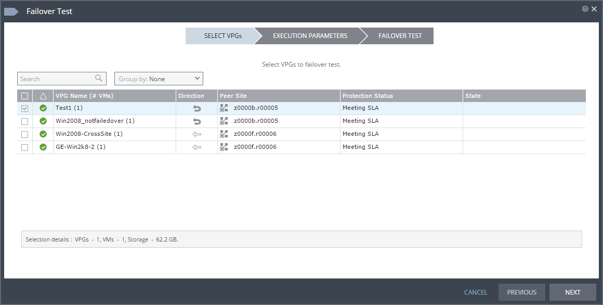

# How to perform a failover

## Overview

You may want to perform a failover in the following circumstances:

- To recover virtual machines (VMs) after a disaster, if you're using Disaster Recovery as a Service or the UKCloud for VMware Journaling Protection option

- To migrate workloads from a local, on-premises environment onto the UKCloud platform

With Disaster Recovery as a Service and Journaling Protection, you can also run a test failover to verify that, during recovery, your protected VMs are correctly replicated at the target site.

> [!IMPORTANT]
> During the failover process, any change in the configuration or state of the live or failed‑over VMs (for example, power on or power off) will cause failure of the failover and may corrupt the VPG. This could make a full resync necessary and, in a disaster recovery situation, could prevent failover completely.

### Intended audience

To perform the steps in this guide you need access to the Zerto Self-Service Portal (ZSSP) in the target zone.

## Running a test failover

If you use Disaster Recovery as a Service or Journaling Protection, you should periodically run test failovers to verify that, in the case of a live failover, your VMs can be recovered successfully.

When you run a test failover, a test VM is created for each of your protected VMs in a sandbox on the target site, using the test network specified in the virtual protection group (VPG). During the test, your VMs' journals continue to be updated and new checkpoints generated, ensuring that your VMs remain protected and can be fully recovered in the event of an actual live failover.

> [!NOTE]
> When the test failover has been instantiated, Zerto will automatically start up the test failover VMs. It is critically important that you do not power on (or power off) the VMs manually in vCloud Director before the failover is completely instantiated. Changing the state of the VMs in vCloud Director before the failover process is complete will result in corruption of the VPG. If you power off a failed-over VMs while a test failover is in progress, replication of live VMs will be affected.

1. Log in to the ZSSP.

    For more detailed instructions, see [*How to access the Zerto Self-Service Portal*](vmw-how-zerto-access-zssp.md).

    Use the ZSSP login link for the zone in which your target VDC is located.

2. At the bottom of the page, make sure that the failover toggle is set to **TEST** and click **FAILOVER**.

   

3. In the *Failover Test* wizard, in the *SELECT VPGs* page, select one or more VPGs that you want to test then click **NEXT**.

   

4. The *EXECUTION PARAMETERS* page shows the most recent checkpoint added to the journal. If you want to use a different checkpoint for the test, click the **Checkpoint** time.

   

5. In the *Checkpoints* dialog, select the checkpoint that you want to use:

    - **Latest** to use the latest checkpoint

    - **Latest Tagged Checkpoint** to use the latest manually added checkpoint

    - **Latest VSS** to use the latest VSS snapshot (this option is applicable only for Disaster Recovery as a Service and if you've installed the Zerto VSS agent on the VM)

    - **Select from all available checkpoints** to select a specific checkpoint from the list below

   

6. Click **OK** then click **NEXT**.

7. In the *FAILOVER TEST* page, review the diagram to see the number of VPGs and VMs included in the test and where they will be recovered to, then click **START FAILOVER TEST**.

    The test begins with an initialisation period, during which the VMs are created in scratch volumes on the target site.

8. You can check the status of the test by clicking the **VPG Name** on the *VPGs* tab.

9. To stop the test, on the *VPGs* tab, click the **VPG Name** and click the **Stop test** icon.

10. In the *Stop Test* dialog, from the **Result** list, choose whether the test succeeded or failed, then click **STOP**.

    You can also provide additional **Notes** to describe the test scenario.

    After you stop the test, the test VMs are powered off and removed.

## Running a live failover

In the event of a disaster, you'll need to run a live failover to recover your VMs. You can also use live failover to migrate your workloads to the target site.

> [!NOTE]
> When the failover has been instantiated, Zerto will automatically start up the failover VMs. It is critically important that you do not power on (or power off) the VMs manually in vCloud Director before the failover is completely instantiated. Changing the state of the VMs in vCloud Director before the failover process is complete will result in corruption of the VPG and potentially the failure of the disaster recovery process.

1. Log in to the ZSSP.

    For more detailed instructions, see [*How to access the Zerto Self-Service Portal*](vmw-how-zerto-access-zssp.md).

    Use the ZSSP login link for the zone in which your target VDC (for recovery or migration) is located.

2. At the bottom of the page, make sure that the failover toggle is set to **LIVE** and click **FAILOVER**.

   

3. In the *Failover* wizard, in the *SELECT VPGs* page, select one or more VPGs that you want to failover or migrate then click **NEXT**.

    > [!TIP]
    > The red border around the wizard provides a visual cue that you are performing a live failover, rather than a test.

   

4. The *EXECUTION PARAMETERS* page shows the most recent checkpoint added to the journal. If you want to use a different checkpoint, click the **Checkpoint** time.

   

5. In the *Checkpoints* dialog, select the checkpoint that you want to use:

    - **Latest** to use the latest checkpoint

    - **Latest Tagged Checkpoint** to use the latest manually added checkpoint

    - **Latest VSS** to use the latest VSS snapshot (this option is applicable only for Disaster Recovery as a Service and Migration to the Cloud, and if you've installed the Zerto VSS agent on the VM)

    - **Select from all available checkpoints** to select a specific checkpoint from the list below

   

6. Click **OK**.

7. The commit policy gives you the opportunity to check the integrity of the recovered or migrated VMs before committing the failover. To change the commit policy, select the **Commit Policy** field and choose:

    - **Auto-Commit** if you want to automatically commit the failover after a specified amount of time if there is no user interaction. Set the amount of time in the **After** field, up to a maximum of 1440 minutes (24 hours). If you want the failover to be immediately committed, enter 0.

    - **Auto-Rollback** if you want to automatically roll back the failover after a specified amount of time if there is no user interaction. Set the amount of time in the **After** field, up to a maximum of 1440 minutes (24 hours). If you want the failover to be immediately rolled back, enter 0.

    - **None** if you do not want to apply a commit policy. You must manually commit or roll back the failover.

8. The shutdown policy determines what happens to the source VMs in the event of a failover. To change the shutdown policy, select the **VM Shutdown** field and choose:

    - **No** to leave the source VMs as they are before starting the failover.

    - **Yes** if the source VMs have VMware Tools available so that they can be gracefully shut down before starting the failover or migration. If the VMs cannot be shut down, the failover fails.

    - **Force Shutdown** to forcibly shut down the source VMs before starting the failover.

9. Reverse protection ensures that when the source VMs are failed over to the target site, the source site becomes the new target site to ensure that the VMs are still protected. To enable reverse protection, select the **Reverse Protection** field and select the check box.

    > [!IMPORTANT]
    > Reverse protection uses the original source VM's virtual disks to pre‑seed the reverse replication, therefore enabling reverse protection will make changes to the source VMs.

10. Click **NEXT**.

11. In the *FAILOVER* page, review the diagram to see the number of VPGs and VMs included in the failover and where they will be recovered or migrated to, then click **START FAILOVER**.

    The failover process creates the VMs in the target site to the selected point in time.

    > [!NOTE]
    > If a VM already exists on the target site with the same name as one of the source VMs, a number is added to the end of the recovered or migrated VM name to ensure that it's unique.

12. If you set a commit policy with a time greater than zero, you can check the integrity of the recovered or migrated VMs before committing (or rolling back) the failover. When you've finished testing, you can either wait for the time to elapse before the auto‑commit or auto‑rollback, or on the *VPGs* tab, click the **VPG Name** and then click the **Commit** or **Rollback** icon as required.

    > [!NOTE]
    > As soon as a live failover is committed, the journal is destroyed and you cannot go back and select a different checkpoint. However, provided reverse protection is not enabled, the original VMs on the source site remain in place.

    When the commit is completed, the VPG will show as being in **Needs Configuration** state. When in this state, editing the VPG configuration may cause reverse protection to begin. If this is not desired, then you should delete VPG as soon as it reaches the **Needs Configuration** state.

## Next steps

Your VMs are now running in the target site, which is now your primary site.

For Disaster Recovery as a Service and Journaling Protection, to return to the source site (or a different site) after the disaster has been resolved, perform a failover to move them to the source site.

For Migration to the Cloud, as soon as you are happy with how your workloads are running in on the UKCloud platform, you can tidy up the source environment.

## Feedback

If you find an issue with this article, click **Improve this Doc** to suggest a change. If you have an idea for how we could improve any of our services, visit the [Ideas](https://community.ukcloud.com/ideas) section of the [UKCloud Community](https://community.ukcloud.com).
