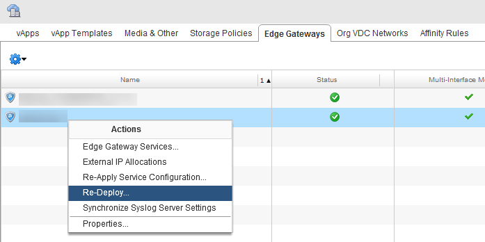

# Cannot manage 5.5.4 edge gateway firewall rules after upgrade to vCloud Director 8.20

## Problem

If your environment is in a region that has been upgraded to vCloud Director 8.20 and your edge gateway includes firewall rules with the protocol **TCP & UDP**, you may see the following **Status** for your 5.5.4 edge gateway:

Cannot configure edge gateway services

If you edit the edge gateway (right-click and select **Edge Gateway Services**) and attempt to add a new firewall rule, you will see the following error:

    [ c1d5cf63-ad11-4360-9a24-85dab04a62e ] Cannot update edge gateway "xxxxxxx-xx"

    vShield Edge:12001:[Firewall] Invalid protocol TcpUdp is specified in Firewall rule.

    -

    vShield Edge:12001:[Firewall] Invalid protocol TcpUdp is specified in Firewall rule.

> [!NOTE]
> This issue affects the management plane only; traffic flow is not affected.

## Cause

This is a known issue with vCloud Director 8.20: https://kb.vmware.com/s/article/2150342

## Solution

You can resolve this issue (or prevent it occurring if your region has not yet been upgraded) by redeploying your edge gateway.

To redeploy your edge gateway, right-click the edge gateway and select **Re-Deploy**.

If the edge gateway is already affected by the known VMware bug where the default gateway is missing or not configured in vCloud, we advise that you contact the Support team before attempting to redeploy your edge gateway. To validate if this is an issue, right-click your edge gateway and select **Properties**, then select the **Configure Default Gateway** tab. If the **Configure default gateway** checkbox is not selected, contact the Support team.

## Feedback

If you find an issue with this article, click **Improve this Doc** to suggest a change. If you have an idea for how we could improve any of our services, visit [UKCloud Ideas](https://ideas.ukcloud.com). Alternatively, you can contact us at <products@ukcloud.com>.
