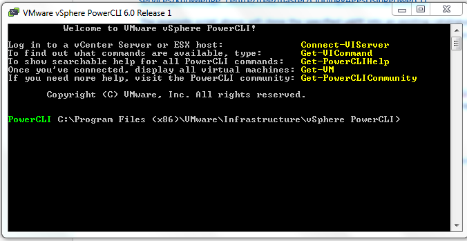
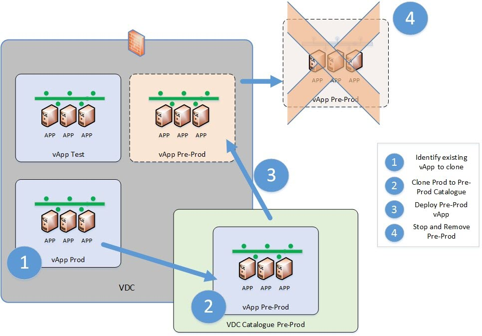

# Cloning vApps using PowerCLI

The vApp can be cloned whilst it is running as long as there is enough storage available on the source storage profiles, associated with the existing vApp. There is a manual GUI option where the vApp can be copied on the UKCloud Portal however this can be a lengthy process if there are number of vApps needing to be copied over. A good use case for this example would be if a customer was utilising like for like copies of production for pre-production environments.

In order to do the cloning efficiently a PowerCLI script is required. This article will guide you through the scripts required to automate the process of cloning, as well as removing this once a vApp is no longer required. The PowerCLI scripts can be plugged into various different configuration like tools such as Puppet or Chef and can also be integrated into orchestration tools such as Jenkins.

### Script to clone vApps

You can find an example of the PowerCLI script to clone and remove a vApp on UKCloud's GitHub repository: <https://github.com/ukcloud/knowledge_centre/tree/master/CloningvAPPsUsingPowerCLI>

The example script clones the specified vApp into an existing catalogue within the appropriate vDC. The script provides an option for deployment once it has been cloned. If you select this option, the vApp is deployed by the script.

### Stop and remove vApp using PowerCLI

When a vApp has been used and is no longer required, there is a remove PowerCLI script that provides an automated way of removing the cloned environment. This script stops the vAPP and then deletes it from the catalogue specified.

The scripts are executed using VMware vSphere PowerCLI. VMware vSphere PowerCLI is a command-line interface (CLI) tool for automating vSphere and vCloud management.

You can download the tool from: <https://my.vmware.com/web/vmware/details?downloadGroup=PCLI600R3&productId=536>.

### Typical Use Case

The figure below shows the flow between cloning a production environment to be re-used as pre-production and the environment being stopped and removed - using the scripts in UKCloud Github repository.

## Feedback

If you find an issue with this article, click **Improve this Doc** to suggest a change. If you have an idea for how we could improve any of our services, visit the [Ideas](https://community.ukcloud.com/ideas) section of the [UKCloud Community](https://community.ukcloud.com).
