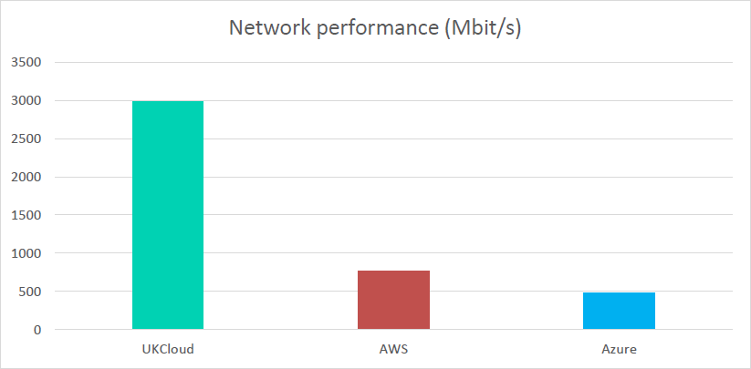
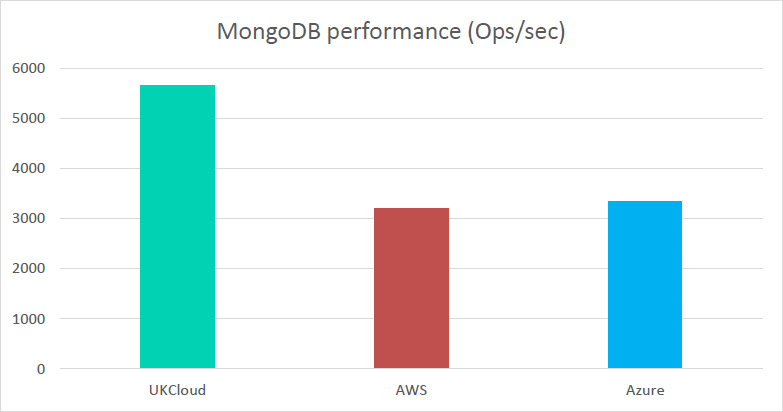
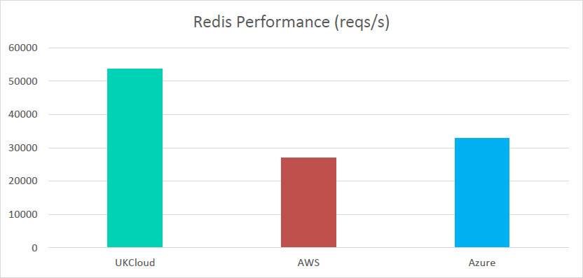
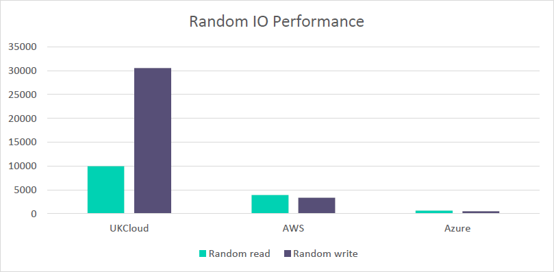
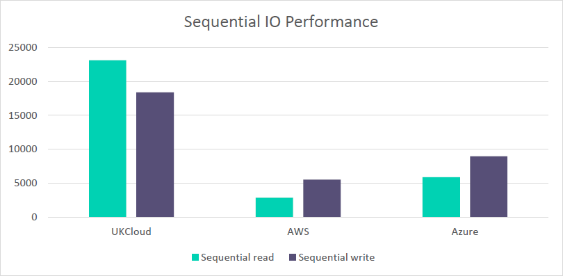

# Comparison of UKCloud for VMware against hyperscalers

## Overview

UKCloud has long been known for its VMware powered cloud that has enabled hundreds of UK public sector workloads to be moved to the cloud. Since the launch of this service, we've made significant investments and numerous innovations in the physical infrastructure, software implementation and the manner in which VMware is utilised.

The service that's available today has been vastly improved in terms of reliability, functionality and performance. Although there are several cloud providers available to the UK public sector, UKCloud maintains its position as the number one choice for security-assured, citizen-facing services with UK data centres and UK-based security cleared staff.

There are several factors to consider when choosing a cloud provider, such as price, performance, reliability, suitability for workloads, sovereignty and assurance. Value for money will often be at the forefront of the decision-making process. However, at UKCloud we are competitive on more than just price and believe performance is an important metric to consider.

This article concentrates on performance benchmarking and introduces a comparison of performance on our VMware platform against other public cloud providers.

## Why does performance matter?

These results are important for several reasons:

- **Cost control** – The superior performance of the UKCloud platform means that you can do more with less. To match our performance using the public cloud providers, you would need bigger instances, more instances or both – significantly increasing the cost of those platforms. A platform that appears 20% cheaper but has half the performance may mean you end up paying 60% more for the same performance.

- **Business productivity** – UKCloud for VMware has been designed specifically for customers transitioning their legacy workloads to the cloud. The majority of legacy applications are running in virtualised environments using VMware and hence can be moved quickly, with less risk, and yet immediately benefit from the elasticity and scalability of the cloud. Superior performance means that you can achieve greater operational efficiency on our platform.

- **User experience** – As digital systems are increasingly used by millions of users (for example, citizens), it's important that your platform can deliver superior performance when your users need it.

## Our approach to benchmarking

To validate the performance of our platform, UKCloud has been running automated tests to compare the performance of UKCloud for VMware against two leading proprietary public cloud platforms: Amazon Web Services and Microsoft Azure.

The benchmarking was based on the PerfKit Benchmarker tool which was originally developed by Google and made available to the open source community. PerfKit is designed to provide a repeatable, consistent and open way of measuring cloud performance.

PerfKit was configured to specifically compare UKCloud for VMware in Region 6, Zone F with AWS EU-West 2 (London) region and the Azure London region. The benchmarks ran throughout August 2017 and average values for the month are reported below.

UKCloud have worked on extending Perfkit to directly support vCloud Director based clouds, this is available from the UKCloud Github pages and will be contributed back to the core repository. This will enable you to run your own benchmarks with up-to-date data, allowing for a ready comparison of our performance against other public cloud providers. You will also be able to compare performance from a set time period of your choice.

## Benchmark results

UKCloud performed a suite of tests to assess the performance of various components of the platform, as well as some end-to-end system tests. The rest of this article provides more detail regarding each of the benchmark results.

> [!NOTE]
> For the graphs shown in this article, a higher result indicates superior performance (UKCloud outperforms AWS on 80% of the benchmarks performed and Azure on 100%).

### Networking performance

The networking performance test is a commonly used benchmark that can create TCP and UDP data streams and measure the throughput of a network that is carrying them. The values shown in the graph below indicate the maximum throughput of the respective networks.

UKCloud has a maximum throughput almost 4 times higher than that of AWS and over 6 times higher than Azure.

This is important for customers who are moving large sets of data or need quick access to their data over the network. This results in less time spent waiting for data transfers to be completed, which allows applications to access their data more quickly, meaning applications are able to run faster, giving a better user experience.

### MongoDB (NoSQL) overall performance*

MongoDB is an open-source database developed by MongoDB, Inc. Unlike relational databases, it stores data in JSON format that can vary in structure. This data model gives you the ability to represent hierarchical relationships and other complex structures easily. MongoDB was designed with high availability and scalability and therefore includes out-of-the-box replication and auto-scaling.

The performance of MongoDB running on UKCloud for VMware is almost 2 times faster than both AWS and Azure meaning that MongoDB performs almost twice as many operations per second on the UKCloud platform.

This results in better database performance and means there is higher data availability to applications, which in turn affects the service that a customer consumes, resulting in a better customer experience.

\* Test performed with 32 threads and a combination of operation types.

### Redis

Redis is an open-source, in-memory data structure used as a database, cache and message broker. Supported data structures include strings, hashes, lists, sets, stored sets, bitmaps, hyperloglogs and geospatial indexes. The outstanding performance of Redis is achieved through an in-memory dataset. Depending on what you use RDB (Redis) for, you can benefit from on-disk persistence by dumping the dataset to disk or appending each command to a log.

RDB (Redis) running on UKCloud is 2 times faster than AWS and almost 2 times faster than Azure, meaning that Redis can perform twice as many requests per second on our platform.

This results in better caching and message throughput which means that smaller clusters of data are required for the same workload. This also means that fewer VMs are required for the workload, therefore saving the user money.

### Random IO performance

Random read is a measure of how quickly multiple small files can be read from random areas on a disk. Random read performance is measured in input-output operations per second with the number shown below an indication of the maximum number of reads. Random write uses the same disk pattern as random read but data is written to the disk rather than read.

The graph below shows that the UKCloud platform performs 2.5 times faster random read IOPs than AWS and over 15 times faster than Azure. For random write, the UKCloud platform performs 9 times more IOPs than AWS and almost 61 times more than Azure.

This means that enterprise applications such as relational databases which are disk-intensive (require high I/O), perform better on the UKCloud platform.

Databases and applications that are disk intensive are often slowed down by their storage, hence the increased popularity of Solid State Drives (SSD). However, as the graph below shows, UKCloud provides fast storage access allowing applications to rapidly access and process data, resulting in faster applications compared to AWS and Azure’s equivalent storage option.

### Sequential IO performance (IOPS)

Sequential read is a disk access pattern where large continuous blocks of data are read from adjacent locations on the disk. Sequential write is the same pattern, but data is written to the disk rather than read. These kinds of disk access patterns are common when accessing large multimedia files such as music, video and images. They are also important for data warehouses and analytics applications.

The graph below shows that for sequential read the UKCloud platform performs 8 times better than AWS and almost 4 times better than Azure. For sequential write, the UKCloud platform has a maximum IO over 3 times higher than AWS and 2 times higher than Azure.

As with databases, these kinds of applications are often slowed down by their storage, hence the increased popularity of solid state drives (SSD). However, as the graph below shows, UKCloud provides fast storage access allowing applications to rapidly access and process data, resulting in faster applications compared to AWS and Azure's equivalent storage option. High sequential IO performance is vital for data analysis and specifically for data warehouses which are a core component of business intelligence and thus guide key management decisions.

## Where does UKCloud for VMware outperform public cloud providers?

These results show that UKCloud for VMware consistently outperforms both AWS and Azure across a variety of benchmarks; (UKCloud outperforms AWS on 80% of the benchmarks performed and Azure on 100%).

- **Networking performance**

  - Almost 4 times higher than AWS

  - Over 6 times higher than Azure

  - **Users spend less time transferring data on the network, allowing applications to access their data faster and thus running faster also**

- **MongoDB performance**

  - 2 times faster than AWS and Azure

  - **Better database performance allows for higher data availability to applications, therefore resulting in a better customer experience**

- **Redis performance**

  - 2 times faster than AWS

  - Almost 2 times faster than Azure

  - **Smaller clusters of data are required for the same workload – this means fewer VMs are required and therefore saves you money**

- **Random I/O performance**

  - Random Read is 2.5 times faster than AWS and over 15 times faster than Azure

  - Random Write is 9 times faster than AWS and almost 61 times faster than Azure

  - **Faster storage access allows applications to rapidly access and process data and thus results in faster applications**

- **Sequential I/O performance**

  - Sequential Read is 8 times better than AWS and almost 4 times better than Azure

  - Sequential Write is over 3 times higher than AWS and 2 times higher than Azure

  - **High sequential IO performance is vital for data analysis and specifically for data warehouses, it is a core component of business intelligence and thus guides key management decisions**

## Summary

The data summarised in this article demonstrates that UKCloud not only competes with leading public cloud providers on price but also offers superior performance on our VMware platform.

Using UKCloud for VMware means that you can do *more for less* as you can save money with simple usage-based billing and benefit from the greater performance the platform offers. Although a platform may appear cheaper, if it has half the performance this may mean you could end up paying significantly more for the same performance.

Although actual performance may vary based upon numerous real-world factors such as internet latency, application-tuning and a low risk of multi-tenant contention, we are confident that these benchmark results truly reflect the greater performance that UKCloud for VMware delivers over the nearest equivalent region and VM sizes of both AWS and Azure.

We are continuously investigating ways to improve the performance of our VMware cloud through using the latest versions of VMware, software-defined storage and networking, coupled with adaptive storage and network tuning as the platform is consumed. All of this will reassure our customers that the greater performance delivered today, will remain in the future.

## Feedback

If you find an issue with this article, click **Improve this Doc** to suggest a change. If you have an idea for how we could improve any of our services, visit [UKCloud Ideas](https://ideas.ukcloud.com). Alternatively, you can contact us at <products@ukcloud.com>.