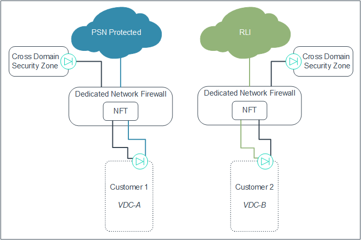
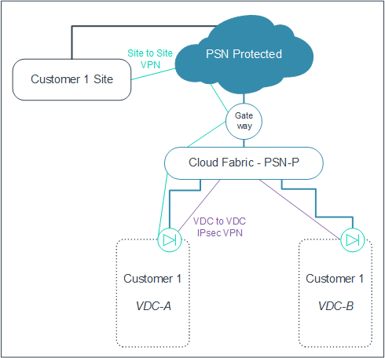

# Understanding connectivity options in UKCloud for VMware

## Introduction

In UKCloud for VMware, UKCloud uses two different architecture designs. You can see this when you deploy virtual data centres (VDCs) onto our IaaS offering. Depending on the type of application you're running, you may see one or both types of network architecture when you deploy your solutions onto the UKCloud platform.

This document explains what the different architectures look like so you can design your solutions to make the best use of them.

## Overview of UKCloud for VMware network architecture

Our UKCloud for VMware service uses multiple security domains (Assured, Elevated and the Cross Domain Security Zone), enabling you to provide a service over the internet, government community networks (such as N3, PSN or JANET) or your own HybridConnect lines.

Each of these networks brings its own challenges for network separation and prevention of accidental bridging. Our network architecture offers two different options to address these challenges. Your Cloud Architect will be able to advise you which solution works best for your application.

- **Network Firewall Tenant (NFT)** - NFTs are either single- or multi tenant instances on Network Firewalls (NFWs), depending on the network that the VDC is connected to. NFWs share an external network connectivity layer connected to the government community network. NFT architecture is used in regions 1, 2, 7 and 8.

- **Cloud Fabric and gateway** - There are no NFTs on shared firewalls, instead we use a shared Cloud Fabric and the separation of connection types is done at the edge level. Cloud Fabric and gateway architecture is used in regions 5 and 6.

## NFT network architecture

With our NFT network architecture, we use a slightly different design, depending on the network you are connecting to. If you've already used UKCloud IaaS then you'll probably already be familiar with the way the NFT architecture presents itself.

### Single network architecture (internet)

All VDCs on the Assured platform have outbound connectivity to the internet. When connecting a VDC to the internet (and no other network), we use the architecture shown the diagram below.

You can see that Customer 1 has two VDCs, each of which has its own edge connected to the same NFT. Customer 1 and Customer 2 have separate NFTs on the same multi‑tenant NFW, which is on the shared internet facing network.

From a customer management experience, you manage all your connectivity rules, such as firewall, IPsec VPN and NAT functionality, through your edge, using either the UKCloud Portal GUI or API.

We manage the NFW and provide additional controls around whitelisted ports, metering and packet shaping.

### Multiple network architecture (PSN Assured and N3)

If you want to add other networks to your VDC (for example, the health and social care network (N3) or PSN Assured), you can enable these connections through the same edge as your internet connection. This is possible because the separation of connectivity happens at the NFT. The NFT resides on a single tenant NFW to comply with the security requirements of these networks.

In the diagram above, you can see that Customer 3 uses the same edge to connect to both the internet and the N3 network through an NFT on a single tenant NFW. Customer 4 uses a similar architecture to connect to the internet and PSN Assured.

Management-wise, you can see the external IP range on the edge. Typically, you use this range for internet connectivity. However, in the case of PSN Assured and N3, we translate the address on the NFW before routing it to the edge. You won't see your PSN Assured or N3 address in your IP allocation, but your users will need to target the address to reach your service.

#### PSN Assured

If you're adding PSN Assured connectivity to a VDC, we translate each PSN Assured IP address to one of your external IP allocations, consuming one of your internet IPs.

#### N3

If you're adding N3 connectivity to a VDC, we translate the N3 IP to one of the following:

- One of your external IP allocations, consuming an internet IP.

- A private address of your choice, bypassing the edge and enabling you to route the traffic directly to a virtual machine (VM) with the same private address. This retains your external IP allocation but limits the use of your N3 IP address.

### Multiple network architecture (Janet)

If you want to connect to the Janet network, the network architecture is slightly different to that of other government community networks.

As Janet is a new network in the UKCloud portfolio, we're able to
leverage the changes to network connectivity in UKCloud for VMware. This means we can utilise the Cloud Fabric and Gateway model to
present the Janet connection.

In the diagram above, you can see two edges on the VDC: one presents the internet connectivity, and the other presents the Janet connectivity. The Janet-facing edge connects into the Janet Cloud Fabric and then out to the Janet network via the UKCloud managed gateway.

The Janet facing edge has the same functionality as the internet facing edge and you can see your Janet IP address in the IP allocations on the edge. You manage the internet facing and Janet facing edges separately through the UKCloud Portal GUI or API.

### Networking in the Elevated platform

Networking in the Elevated platform is very similar to the Assured platform. All connectivity is routed through the same edge on the VDC, and separation of connections occurs within the NFT.

#### PSN Protected

In the diagram above, Customer 1's PSN Protected connection is routed to their NFT sitting in the multi-tenant NFW. This then provides the onward connection to Customer 1's edge. The same NFT also handles the connections in from Cross Domain Security Zone products (Walled Garden, UKCloud Guard and SRA).

It's worth noting that UKCloud translates the PSN Protected IP address to one of the external IP ranges that are available on the edge. Your users will target the PSN Protected IP address, however you'll see only your UKCloud allocated external range on your edge, so it's important to know what your PSN Protected IP has been translated to.

#### RLI

The RLI is also available in the Elevated platform, however it is not natively connected to the UKCloud platform. This means that, to facilitate a connection to the RLI, you must go through the assurance process provided by the MOD to gain access to the RLI; only then can we complete the connection between the RLI and your VDC. The NFT for RLI sits in a single tenant NFW in line with MOD connection compliance.

### Networking between VDCs

You have three options when networking between VDCs. Each option has a slightly different use case.

#### Option 1: Shared networks

Shared networks are useful when you have multiple VDCs within the same organisation boundary (sometimes referred to as a vOrg). You can create networks that span VDCs, enabling VMs within different VDCs to communicate with each other. This is particularly useful if you have VDCs with VMs that are operating at different service levels (ESSENTIAL, POWER and PRIORITY) and need to have inter-VM communication.

#### Option 2: IPsec VPN

If you need VDC communication between VDCs that reside either in different regions, vOrgs or even in external data centres then you should use IPsec VPN tunnels. You can configure these on the edges of the VDCs that you are connecting. It's worth noting that you should configure the IPsec tunnels using your external IP address allocation, in both the Assured and Elevated platforms. In the Assured platform, each IPsec tunnel consumes an external (internet) IP.

#### Option 3: Static routes

Use static routes as an alternative to a shared network where you want more control of traffic between VMs if the VDCs you're connecting reside on the same NFT. As traffic must traverse the edge, you can put in extra rules around connectivity to lock down communication between VMs in different VDCs. This enables you to construct DMZs or separate out services to different users while continuing to communicate between your VMs.

### Bringing your own firewall

In most circumstances, the UKCloud provided edge will work for your solution. However, if your solution requires next generation firewall functionality, such as malware detection, antivirus protection, URL filtering or complex load balancing, you can provide your own firewall solution. Note that if you choose to bring your own firewall, you're completely responsible for the deployment, configuration and management of that firewall.

If you plan to deploy a firewall into a new VDC, let us know and we'll provision you a VDC with a dedicated network for you to deploy your firewall onto.

If you change from a UKCloud‑provided firewall to your own firewall, we'll redeploy your firewall on to a dedicated network and you'll need to migrate your environment to that network.

### IP address allocations

When you create a new vOrg, we'll provide you with a number of usable IP addresses per project, depending on the network you are connecting to:

- Internet - 5 x usable IPs

- N3 - 1 x usable IP

- PSN Assured - 1 x usable IP

- Janet - 1 x usable IP

- PSN Protected - 1 x usable IP

You can request additional IP addresses as required via a Service Request. If you ask for a large number of IP addresses in a single request, we may ask you to provide further information to support your request.

## Cloud Fabric and gateway architecture

The Cloud Fabric architecture utilises multi-tenant networks connected to UKCloud-managed gateways that provide external network connectivity to internet and government networks. The customer-managed edges are connected to the multi-tenant network and enable you to control firewall settings such as NAT, VPN and load balancing. There are no NFTs in the Cloud Fabric architecture so all the firewall settings are controlled by the edge VM.

### Single network architecture

The diagram below shows how VDCs connected to a single network look using our new Cloud Fabric and gateway architecture.

You can see that there is no NFT layer; instead each customer VDC has a edge that is connected directly into the multi‑tenant Cloud Fabric. This is then connected to a UKCloud‑managed gateway with onward connection to the internet.

From a customer management experience, you manage all your connectivity rules, such as firewall, IPsec VPN and NAT functionality through your edge, using either the UKCloud Portal GUI or API.

UKCloud controls the gateway out to the internet and provides metering and packet shaping, however you are in full control of ports.

### Multiple network architecture

Most differences between NFT and Cloud Fabric can be seen with multiple network architectures. To achieve network separation and ensure security and compliance with government community networks, we've developed a new VDC edge architecture.

In the diagram above, you can see that if you want to add other networks to your VDC (for example, N3, PSN Assured or Janet), you need separate edges to facilitate that connection. These edges have the same style of connectivity as the internet facing edge: an edge that connects into a Cloud Fabric, dedicated to that particular network, which then has onward connectivity to the government community network through the UKCloud‑managed gateway.

Customer management is on a per-edge basis. You'll see multiple edges within your UKCloud Portal GUI and you'll need to manage these individually. The full functionality of each edge is available for every network connectivity, however UKCloud manages the port whitelist for all government connected networks.

### Network architecture for the Elevated platform

Networking in the Elevated platform is the same as the Assured platform from a management perspective. Just like the Assured platform, there is edge separation for the different networks that feed into the Elevated platform.

As the diagram above shows, the edge is connected to a Cloud Fabric with nward connectivity to the PSN Protected network. There is also an internal Cloud Fabric that connects the Elevated VDC to the Walled Garden, enabling cross-security domain communication.

### Networking between VDCs

You have two options for communicating between VDCs. Both these options will be familiar if you already use our platform, but if you're used to using static routes, you'll need to use one of the two options below instead for all inter-VDC communication.

#### Option 1: Shared networks

Shared networks are useful when you have multiple VDCs within the same vOrg and region. You can create networks that span between VDCs, enabling VMs within different VDCs to communicate. This is particularly useful if you have VDCs with VMs that are operating at different service levels (ESSENTIAL, POWER and PRIORITY) and need to have inter-VM communication.

#### Option 2: IPsec VPN

If you need VDC communication between VDCs that reside either in different regions, vOrgs or even in external data centres then you should use IPsec VPN tunnels. You can configure these on the edges of the VDCs that you are connecting. It's worth noting that you should configure the IPsec tunnels using your external IP address allocation, in both the Assured and Elevated platforms. In the Assured platform, each IPsec tunnel consumes an external (internet) IP.

In the Elevated platform each IPsec tunnel consumes either:

- An external (UKCloud) IP, if the tunnel is configured between VDCs

- An external (PSN Protected) IP, if the tunnel is configured between a VDC and an endpoint on the PSN Protected network

### Bringing your own firewall

In most circumstances, the UKCloud‑provided edge will work for your solution. However, if your solution requires next generation firewall functionality, such as malware detection, antivirus protection, URL filtering or complex load balancing, you can provide your own firewall solution. Note that if you choose to bring your own firewall, you're completely responsible for the deployment, configuration and management of that firewall.

If you plan to deploy a firewall into a new VDC, let us know and we'll provision you a VDC with a dedicated network for you to deploy your firewall onto.

If you change from a UKCloud‑provided firewall to your own firewall, we'll redeploy your firewall on to a dedicated network and you'll need to migrate your environment to that network.

### IP address allocation

The number of public IP addresses we provide depends on whether you are using a UKCloud‑provided firewall or bringing your own:

- **UKCloud provided firewall** - If you're using a UKCloud‑provided firewall, we'll allocate you a single usable IP per VDC edge. You can request additional IP addresses as required via a Service Request. If you ask for a large number of IP addresses in a single request, we may ask you to provide further information to support your request.

- **BYOF** - If you're using your own firewall technology, when you provision your VDC, we initially allocate you five public IP addresses. After this initial allocation, you can request more IP addresses by opening a Service Request.

## Maintaining compliance with multiple networks

When connecting to the different UKCloud networks it's important to ensure that you uphold network connection compliance. To this end, the way you access the different government community networks has not changed in Enterprise Cloud Compute.

In the Assured platform, you'll always have an internet connected edge. Access to other networks is as follows:

- For N3 you'll need to go through the UKCloud aggregation process

- For PSN Assured you'll need to get accreditation for the service you wish to provide from the PSN Authority

- For Janet you'll need to engage with your Cloud Architect

In the Elevated platform:

- For PSN Protected you'll need to gain approval from the PSN Authority

- For RLI you'll need to get approval from the MOD

- For Cross Domain Security Zone services (Walled Garden, UKCloud Guard or SRA) you'll need to get the authorisation from your end-customer IA as well as the UKCloud SIRO

The application processes haven't changed for any of these services, however it's important to be mindful about how you may have to design your architecture based on the network architecture you'll be deployed on. As an example, when connecting to the N3 network, you'll need to ensure that the N3 and internet networks aren't bridged. With the Cloud Fabric architecture and NFT architecture (shown in the two diagrams below respectively), you should ensure that VMs are not connected to both the internet and to N3
at the same time.

## Feedback

If you have any comments on this document or any other aspect of your UKCloud experience, send them to <products@ukcloud.com>.