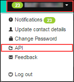

# Managing your UKCloud for VMware environment using the UKCloud Portal API

With the development of the UKCloud for VMware service for G‑Cloud 8, we've introduced some changes to the architecture underpinning the platform. The change in architecture introduces the concept of sites, regions and zones to enable you to design resilience into your solutions in a way that works best for you.

- **Sites** will be a familiar concept if you're already on the UKCloud platform. We have two sites, one in Corsham and one in Farnborough, creating the ability to deploy disaster‑resilient solutions across two geographically disparate locations.

- **Regions** are a new concept in UKCloud for VMware. Within each site we have independent regions, enabling you to create resilient solutions within a single site, allowing for protection such as synchronous replication between applications or databases.

- A region is made up of **zones**. A zone typically relates to a single service, and there is usually only one service zone per region. However, in the case of UKCloud for VMware, there may be multiple UKCloud for VMware zones in a single region, enabling you to build up services that are underpinned by different compute and storage but the same network.

For more information, see [*Understanding sites, regions and zones*](../other/other-ref-sites-regions-zones.md).

When managing the platform through the Portal API, if you've designed your solution across multiple regions, you must use different credentials for each environment that you're managing. Also, because each region has its own management instance, you must use the API endpoints that apply specifically to the region. This is important to remember so that you call the correct endpoints if your solution is deployed across multiple regions. You can find out which endpoints to use by clicking your username in the top right corner of the UKCloud Portal home page and selecting API:

Using the API page to find the correct API URL for each region:

## Feedback

If you find an issue with this article, click **Improve this Doc** to suggest a change. If you have an idea for how we could improve any of our services, visit the [Ideas](https://community.ukcloud.com/ideas) section of the [UKCloud Community](https://community.ukcloud.com).
