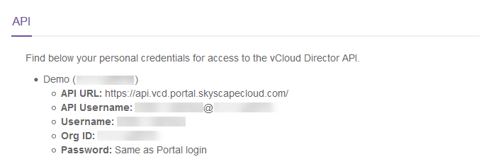

# Managing your UKCloud for VMware environment using the UKCloud Portal API

## Overview

Sites, regions and zones within the UKCloud platform enable you to design resilience into your solutions in the way that works best for you.

- **Sites.** We have two sites, one in Corsham and one in Farnborough, creating the ability to deploy disaster‑resilient solutions across two geographically disparate locations.

- **Regions.** Within each site we have independent regions, enabling you to create resilient solutions within a single site, allowing for protection such as synchronous replication between applications or databases.

- **Zones.** A region is made up of zones. A zone typically relates to a single service, and there is usually only one service zone per region.

For more information, see [*Understanding sites, regions and zones*](../other/other-ref-sites-regions-zones.md).

## API authentication credentials and endpoints

When managing the platform through the Portal API, if you've designed your solution across multiple regions, you must use different credentials for each environment that you're managing. Also, because each region has its own management instance, you must use the API endpoints that apply specifically to the region. This is important to remember so that you call the correct endpoints if your solution is deployed across multiple regions. You can find out which endpoints to use by clicking your username in the top right corner of the UKCloud Portal home page and selecting **API**:

You can then use the information on the API page to find the correct API URL and credentials for each environment:

## Feedback

If you find a problem with this article, click **Improve this Doc** to make the change yourself or raise an [issue](https://github.com/UKCloud/documentation/issues) in GitHub. If you have an idea for how we could improve any of our services, send an email to <feedback@ukcloud.com>.
