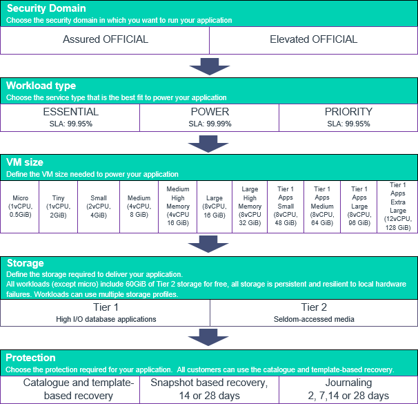

# UKCloud for VMware options

## Introduction

Each enterprise application has its own set of technical and service requirements that must be addressed on an individual basis. UKCloud for VMware is completely configurable, and gives you the flexibility to use different service levels, virtual machine (VM) sizes, security domains, connectivity and data protection options.

^ All workloads include 60GB of Tier 2 storage for free, all storage is persistent and resilient to local hardware failures. Workloads can use multiple storage profiles

^^ All customers can use catalogue and template-based recovery

## Security domain

The UKCloud provides two security domains:

- Assured OFFICIAL provides access to public networks, such as the internet, PSN Assured, N3/HCSN and Janet

- Elevated OFFICIAL provides access to restricted networks such as PSN Protected

Choose the security domain your workload needs to use.

## Workload (VM) type

Some workloads require the highest levels of resilience and performance, some are sensitive to changing conditions, whereas others merely require a reliable infrastructure. Tailor the compute characteristics of the VM to support the requirements of your workload.

Choose the workload type that best suits your application:

- **ESSENTIAL** - For lower priority workloads, such as temporary applications, data processing or system modelling tasks. VMs in the VDC can have contended compute resource allocation (CPU/RAM) and automated rebalancing is enabled to ensure the workload receives the requested performance.

- **POWER** - For key workloads that are resource intensive, such as web and application workloads, mid-sized databases and caching services. VMs in the VDC have an uncontended compute resource allocation and automated rebalancing is enabled to pre-emptively optimise performance and availability.

- **PRIORITY** - For critical workloads that handle important business processes that benefit  from a steady state of operation. VMs in the VDC have an uncontended compute resource allocation and automated rebalancing is configured to reduce workload movement around the platform.

## Storage options

You can choose from a variety of options, depending on whether your workload requires high performance or longer-term retention storage. You can even deploy mixed environments to deliver exactly what you need.

Choose any additional storage needed to support your application and add as many storage options as you need for the different aspects of your application. For example, you could use Tier 1 storage for the high I/O database application and Tier 2 to store seldom-accessed media.

- **Tier 1** storage provides fast block storage, optimised for data warehouses, busy transactional databases and other high IO workloads.

- **Tier 2** storage provides general all-purpose block storage, providing a balance of performance and cost.

- **Geo-Resilient** storage works in combination with synchronous protection to replicate storage across a SAN that spans both UKCloud sites.

## Data protection options

Whether you're driven by recovery point (RPO) or recovery time (RTO), you can choose the right level of automated, on-platform protection for your environments.

The UKCloud for VMware service offers three different protection options for your VMs.

- **Catalogue and template-based recovery** is a configuration management solution that can reprovision stateless servers to a new VM when required, using standard and catalogue-based VM templates.

- **Snapshot Protection** provides a daily backup of your VMs. You can select a retention period of either 14 or 28 days.

- **Journaling Protection** uses journals to store all write operations made to your VMs on a separate UKCloud site.

- **Synchronous Protection** provides geographical protection of your live environments across both UKCloud sites by synchronously replicating VMs between both sites. This ensures that any changes made to your environment are committed to both arrays in both sites simultaneously.

Choose the application and data protection needed for your solution. You can choose only one protection option to cover both VMs and storage. For example, if you choose Journaling Protection for your VMs, you cannot then choose 14-day Snapshot Protection for your storage; Journaling Protection will apply to both.

## Feedback

If you have any comments on this document or any other aspect of your UKCloud experience, send them to <products@ukcloud.com>.