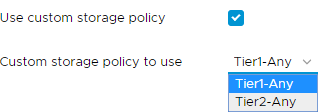

# Storage policies

## Overview

Each Virtual Machine (VM) is bound to a storage policy whereby the storage policy guarantees a certain level of capacity, performance, availability, redundancy, and so on from a storage perspective.

> [!NOTE]
> A storage policy does not contain a VMs data; it merely defines the storage service level.

When you create virtual machines (VMs) within vCloud Director, as part of the process you will be prompted to choose a storage policy to assign to that particular virtual machine. This will be presented as a drop-down list where you will have a few options depending on the service level of your VDC. An example of this is below, showing the storage policies available on the Basic service level.

The ability to choose storage policies is useful in certain scenarios where VMs are required to be on different underlying storage. An example of this would be a replicated database server with separation of replicas onto different storage profiles.

## Storage policies description

Storage policies enable you to choose where the VM sits on the underlying infrastructure, giving you flexibility in terms of VM placement.

The storage profiles are all at the same storage tier (for example, Basic) and all make use of the array in the same way (that is, the same mix of flash, SAS and NL-SAS). We provide three storage profiles to provide you with the option of influencing where the VM/data is located.

- **STANDARD-Any** is the default and allows for the VM to be placed as UKCloud determine.

- **STANDARD-Storage1** and **STANDARD-Storage2** are the profiles that allow the storage placement to be decided by you. VMs associated with **Storage1** are located on different data stores and disks compared to VMs associated with **Storage2**.

## Limitations

Customers with Optimised Storage enabled (service request via the [My Calls](https://portal.skyscapecloud.com/support/ivanti) section of the UKCloud Portal) will be able to select their Optimised Storage policy within the drop-down box shown above. Beyond this, UKCloud only offer Storage1 and Storage2 storage policies, and don't scale this out further.

Storage policies are only available for production environments; trial and test/dev environments do not have user-configurable storage policies.

## Feedback

If you find an issue with this article, click **Improve this Doc** to suggest a change. If you have an idea for how we could improve any of our services, visit the [Ideas](https://community.ukcloud.com/ideas) section of the [UKCloud Community](https://community.ukcloud.com).
