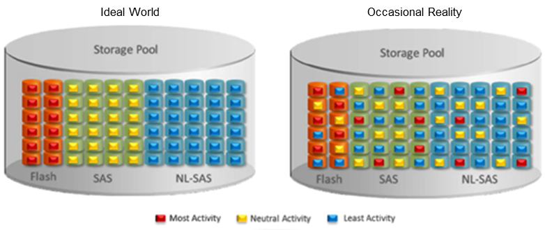
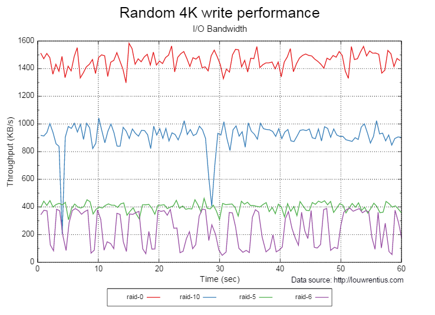
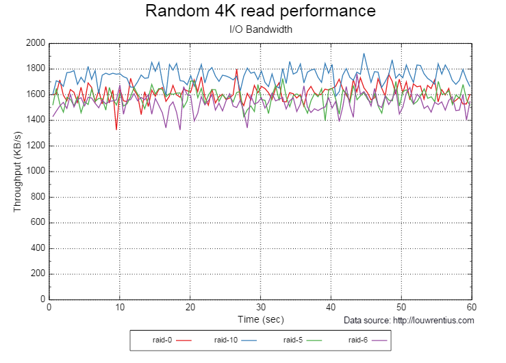

# Tier 1 storage

## Introduction

UKCloud's block storage uses a blended mix of enterprise flash drives, SAS, and NL-SAS disks in RAID 5 and RAID 6 configurations. To achieve the right balance of performance and cost, we use automated storage tiering, where data is tiered according to access patterns. Frequently accessed data will reside on quick-access flash drives, while data that's accessed less frequently (catalogue images, for example) will reside on slower NL-SAS disks. The system evaluates data access over 24-hour periods and may reallocate data to ensure the best system efficiency.

We recommend that customers try using the standard Tier 2 storage before deciding to migrate to Tier 1 storage. This is because the use of three tiers of media combined with an additional SSD caching layer, is still the most efficient way to store data for most applications for a couple of key reasons:

- Most application data ages - data that was once read or changed many times a day eventually becomes out of date or no longer relevant, so is no longer being read or changed. Automatic data tiering moves cold data from SAS or SSD into cost-efficient NL-SAS, not only freeing up space for hotter data on faster media, but also driving down the cost of storing the data.

- Some applications or parts of applications don't require the low latency that the faster media gives. Examples of this include user file systems or parts of multi-layer applications such as SharePoint.

Following feedback from our customers and partners, UKCloud has identified that application latency or unpredictable performance can sometimes stem from the use of the standard three-tier pools for some applications. This happens when data relocation doesn't happen fast enough to adapt to the change in workload profiles. The figure below shows an ideal world compared with reality for data distribution across tiers.

To address this issue UKCloud has developed Tier 1 storage to ensure that applications that require consistent or high write performance can achieve it.

## What is Tier 1 storage?

Tier 1 storage sits on enterprise-class technology, so still benefits from the feature set available on the standard Tier 2 storage. However, there are a few subtle changes that increase the performance of workloads sitting on Tier 1 storage.

- By removing the NL-SAS layer and using a two-tier pool of performance media (SAS and SSD), the negative effect of tiering on the consistent performance of data is reduced. This is because even workloads that are accessed infrequently are serviced by faster spinning media (see the figure below).

    

- By increasing the ratio of SSD to SAS, we ensure that a higher proportion of customer data can sit on enterprise flash, rather than on spinning media. So workload IO is serviced a lot quicker.

- Placing all the drives in RAID 10 configurations rather than a blend of RAID 5 and RAID 6 improves response times of writes to storage under high load. Response times are improved because the storage processors need to do fewer RAID calculations to commit new writes to disk. During periods of high workload, this enables the cache to flush quicker, allowing more host write IOs to be serviced by the storage.

## Good candidate workloads for Tier 1 storage

UKCloud has identified that Tier 1 storage is best for the following use cases.

### Applications that need consistent performance

The nature of multi-tenant environments means that data can sometimes be pushed down to SAS/NL-SAS, even if it is hot. This is because other customers' application data may be hotter. Having a large pool of SSD and no NL-SAS will ensure that customer data has a more predictable performance for both reads and writes.

### Applications with a high write-to-read ratio (+50% w/r)

Some applications will have a large amount of data creation or change, which will involve a lot of write IO to the storage. Using RAID 10 lowers the overhead of the RAID calculation, which reduces the latency of cache flushing to disk.

### High-performance applications

High-performance applications are generally databases or virtual desktops, which require high read and write performance.

### Data warehousing

There are two data warehousing use cases:

- Occasionally, data may be loaded onto the UKCloud platform but not accessed for a period of time; this data would normally be de-staged to NL-SAS. By not having NL SAS in the Tier 1 pool, the lowest tier will be SAS, which will still provide good performance of both reads and writes, even if the data has been cold for a long time.

- Alternatively, data can be stored in UKCloud's Cloud Storage and loaded into the Tier 1 storage platform when needed. This maintains high performance for active data without the associated cost of storing infrequently accessed data.

### Small block, random-write databases

Data with a high volume of small random writes will benefit from the enhanced performance that comes from using RAID 10 as the underlying storage. As the graphs below show, the RAID 10 write performance is much better than RAID 5 and RAID 6 for small block writes.

### Large data sets

The higher ratio of SSD to SAS means there's a higher chance that data within a given dataset will be in flash media, accelerating database performance.

## Unsuitable candidate workloads

The following workloads would be considered unsuitable as they won't benefit from Tier 1 storage.

### Rich media

Rich media such as images and audio won't benefit from enhanced write performance.

### Applications that don't need consistent performance

Although not necessarily an unsuitable candidate, if a workload doesn't require consistent performance, there will be no real benefit in putting the data on Tier 1 storage.

### Low-performance applications

Applications that don't need high performance aren't necessarily unsuitable candidates; they just won't see any real benefits from Tier 1 storage.

### Applications with a high read-to-write ratio (+50% r/w)

Applications with a high read ratio don't really benefit from the added performance that Tier 1 storage provides. As the graph below shows, RAID10 doesn't show a real performance increase on reads compared to the other RAID configurations.

## Identifying good candidate workloads

In most cases, you'll be able to judge which workloads are best suited for Tier 1 storage. However in some cases, you may need guidance on which storage a particular application requires.

If your application isn't currently running on UKCloud's platform or on another environment, we would recommend building it on the standard Tier 2 storage pool initially. You can then assess its performance once it has been set up and is running under load, and decide whether the workload should be moved to Tier 1 storage.

If the workload is currently running on any environment, it's possible to run a performance assessment on the application to understand its characteristics, enabling you to make an informed decision on where it is best placed. You would carry out the performance assessment yourself, supported by one of our Cloud Architects.

## Limitations

Tier 1 workloads are available with the Essential, Power and Priority VM types.

Initially, moving a workload to and from the Tier 1 platform will be a manual process that may involve raising a Service Request via [My Calls](https://portal.skyscapecloud.com/support/ivanti) on the UKCloud Portal.

## Realistic performance expectations

The performance that can be expected from the system will depend on many factors, such as the application's read/write ratio, and whether the IO will be random or sequential in nature.

UKCloud's storage platforms are shared by all consumers within the boundary of the security domain. This means we can't provide a guaranteed minimum IOPs or throughput; however, the performance of individual data stores is actively monitored. We regularly review the data store usage metrics, and perform migrations of virtual machines to less populated data stores to alleviate contention.

## For more help

If you need more help, contact UKCloud Support or engage with your Cloud Architect.

## Feedback

If you find a problem with this article, click **Improve this Doc** to make the change yourself or raise an [issue](https://github.com/UKCloud/documentation/issues) in GitHub. If you have an idea for how we could improve any of our services, send an email to <feedback@ukcloud.com>.
