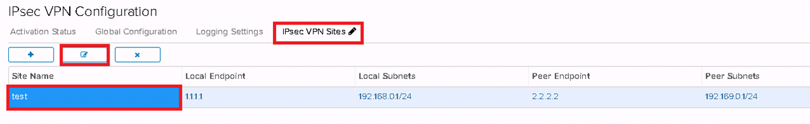

# Fixing your IPsec VPN following upgrade to NSX 6.4

With the upgrade to NSX version 6.4, VMware have made a security change to the default settings of the NSX edge gateway's IPsec VPN service. The new default for IPsec VPN service is to use the DH-14 (Diffie–Hellman group 14) algorithm during phase 1 negotiation of the VPN tunnel. You have the option of selecting a different version of Diffie-Hellman in the advanced gateway GUI. The following versions are supported:

- DH-2 (Diffie–Hellman group 2)

- DH-5 (Diffie–Hellman group 5)

- DH-14 (Diffie–Hellman group 14)

- DH-15 (Diffie–Hellman group 15)

- DH-16 (Diffie–Hellman group 16)

However, during the upgrade of one of our regions we discovered that for edges that have not been converted to advanced gateways that have VPNs configured, the upgrade changes the config on the VPN tunnels to use the DH-14 algorithm instead of the previously only available DH-2.

As a result, VPN tunnels are then broken until either of the following is performed:

- The edge with the affected VPN is upgraded to an advanced gateway and the VPN config is changed from DH-14 back to DH-2

- The peer end config is amended to use DH-14 for its ike negotiation

UKCloud support staff can change the VPN config back to DH-2 on a temporary basis until the edge is converted, however the setting is not persistent, and under certain configuration changes to an edge, the setting of DH-14 may be reapplied. Converting to an advanced gateway does not require any downtime nor cause any outage during the conversion.

Follow the steps below to convert your edge to an advanced gateway and configure your VPN back to DH-2. To complete these steps, you must have access to the UKCloud Portal and vCloud Director.

## Convert your edge to an advanced gateway

To be able to set your VPN to the desired DH setting, you first need to convert your edge to an advanced gateway.

To convert your edge to an advanced gateway, see [*How to convert your edge to an advanced gateway*](vmw-how-convert-edge.md) before attempting to continue with the steps below.

## Change your VPN settings

To change the DH setting on your broken VPN:

1. Right-click your edge gateway and select **Edge Gateway Services**.

2. In the new tenant portal, select the **VPN** tab.

3. On the *IPsec VPN Configuration* page, select the **IPsec VPN Sites** tab.

4. Select the VPN tunnel that is broken and click the edit icon.

    

5. From the **Diffee-Hellman Group** list, select DH2.

    

    You may need to scroll the window to the bottom of the page to find the list.

6. When you're done, click **Keep**.

7. Repeat the steps 4 and 5 for any other VPNs that are broken and when you're ready to save the configuration, click **Save Changes** at the top of the page.

    Check the state of the VPN by clicking the **Statistics** tab at the top of the screen and selecting **IPSEC VPN** to view the health of your VPN.

## Feedback

If you find an issue with this article, click **Improve this Doc** to suggest a change. If you have an idea for how we could improve any of our services, visit [UKCloud Ideas](https://ideas.ukcloud.com). Alternatively, you can contact us at <products@ukcloud.com>.