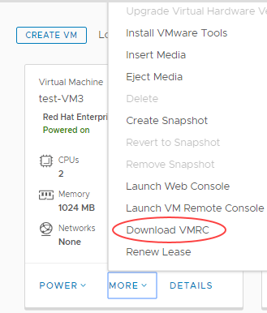
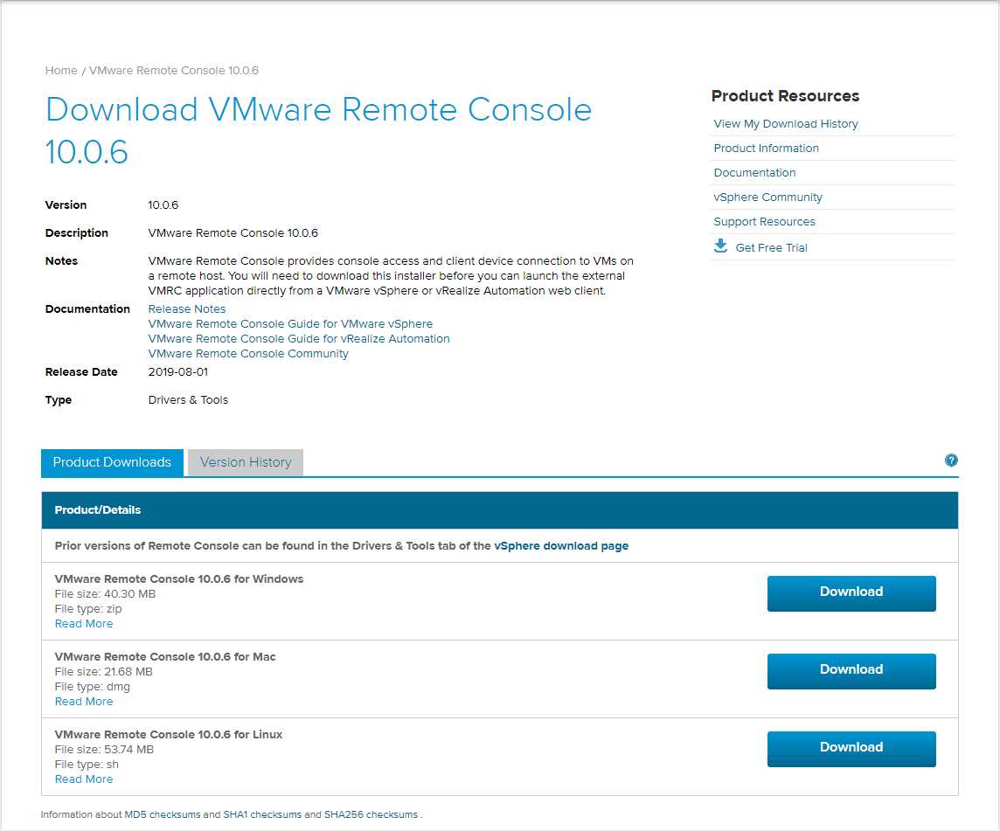
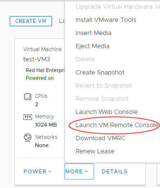

# UK keyboard layout not supported in Web Console

## Issue

The web-based console available in the vCloud Director 9.1 HTML5 UI (tenant portal) does not provide support for a UK English keyboard layout, only US English. This means that when interacting with the console using a UK keyboard, the keys you press on the keyboard may not work as expected in the console. For example, if you press the @ key on your keyboard, this may appear in the console as a " symbol.

## Solution

VMware are aware of this issue and currently plan to address it in vCloud Director 9.7. We will continue to monitor the issue and will let you know if it is addressed any sooner.

In the meantime, the lack of support for the UK keyboard should not cause issues with entering commands in the console. However if you do encounter issues, you can use the VM Remote Console instead. To use the console you'll need to download an application (available for Windows, Linux and Mac) to the local PC client (requires VMware account).

> [!NOTE]
> The VM Remote Console in vCloud Director 9.1 is different from the VMRC used in previous versions of vCloud Director and does not require the client integration plugin, which previously caused issues with browser limitations.

1. In the vCloud Director *Virtual Datacenters* dashboard, select your VDC.

2. In the left navigation panel, click **Virtual Machines**.

    

3. In the card for your VM, select **More**, then **Download VMRC**.

    

4. Click the **Download** button for the version of the console you want to download (Windows, Mac or Linux).

    

5. At this point, you'll need to login to your VMware account.

    > [!NOTE]
    > If you do not have a VMware account, they are free to create, or you can contact UKCloud Support and we'll make the VMRC installer file available to you.

6. Run the VM Remote Console installer then restart vCloud Director.

7. In the card for your VM, select **More**, then **Launch VM Remote Console**.

    

    The VM Remote Console works correctly with a UK keyboard.

    > [!NOTE]
    > There is a current bug that occasionally reports that the VM Remote Console is not installed. If you see this message, and you have installed the console, it should still open normally.

## Feedback

If you find an issue with this article, click **Improve this Doc** to suggest a change. If you have an idea for how we could improve any of our services, visit [UKCloud Ideas](https://ideas.ukcloud.com). Alternatively, you can contact us at <products@ukcloud.com>.
