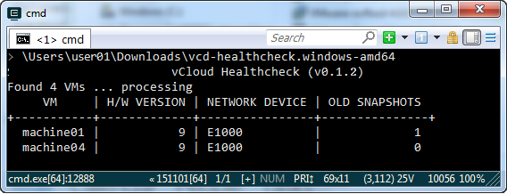

# vCloud Director Healthcheck

## Overview

The vCloud Director Healthcheck is a freely downloadable script that you can run against UKCloud's vCloud Director to provide feedback on misconfigurations or non-optimal configurations.

## Downloading the vCloud Director healthcheck script

You can download the vCloud Director Healthcheck script from the UKCloud GitHub repository:

<https://github.com/ukcloud/vcd-healthcheck/releases>

Zip files containing release binaries are available for Windows and Linux, so download the appropriate file for your platform and extract the script. If you are using another platform, for example, Mac, you can download the source code and compile it yourself.

## Running the vCloud Director healthcheck script

To run the vCloud Director Healthcheck script, run the following command:

    vcd-healthcheck

If the script is not in the current directory or a directory in your PATH, you must specify the full path for the file, for example:

    C:\scripts\vcd-healthcheck

When prompted enter your user name, password and organisation ID.

> [!NOTE]
> The user name is not the email address that you use to login to the UKCloud Portal. If you are not sure of your user name or organisation ID, you can find them on the UKCloud Portal API page at <https://portal.ukcloud.com/user/api>.

Optionally, you can set your user credentials using the following environment variables to prevent being prompted for them:

```
VCLOUD_USERNAME
VCLOUD_PASSWORD
VCLOUD_ORG
```

## How the script works

When you run the vCloud Director healthcheck script, it searches for all VMs accessible to the user account you specified and displays how many it has found. Then, for each VM found by the search, the script checks that it meets the following criteria:

- Hardware version is 9
- Network Device is VMXNET3
- Snapshots are not older than seven days

For any VMs that do not meet the above recommendations, the results for each check are listed so that you can identify which one(s) failed.

For example, in the output below, you can see that out of four VMs found, `machine01` and `machine04` are both using an E1000 network device and `machine01` has one snapshot older than seven days.



If all VMs meet the recommendations, the script displays a success message and exits.

## Feedback

If you have any comments on this document or any other aspect of your UKCloud experience, send them to <products@ukcloud.com>.