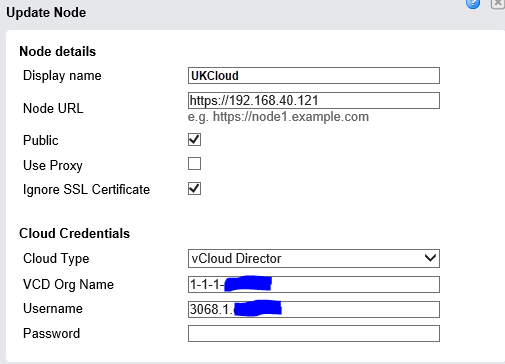
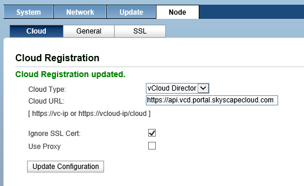

# VMware vCloud Connector

VMware vCloud Connector links your internal private cloud with UKCloud so that you can manage them as a single hybrid environment and transfer workloads back and forth.

The use of vCloud Connector is supported on the platform, but we do not offer support in configuring vCloud Connector or its use.

We have verified the following connection settings as being in the correct format to authenticate against our platform.

## For vCC server

## For vCC node

Time Zone settings need to be the same on both Node and Server

Login details are the same as for the *API interaction through PowerCLI*

## More information

For more information about vCloud Connector, visit http://www.vmware.com/uk/products/vcloud-connector.

## Feedback

If you have any comments on this document or any other aspect of your UKCloud experience, send them to <products@ukcloud.com>.