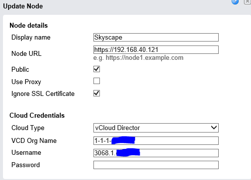

# VMware vCloud Connector

> [!IMPORTANT]
> VMware vCloud Connector is now end-of-life and is no longer supported. 
>
> UKCloud offers Disaster Recovery as a Service (DRaaS), powered by Zerto, to support active migration across environments. See the [*Disaster Recovery as a Service Service Definition*](../draas/draas-sd.md) for more information.

VMware vCloud Connector links your internal private cloud with UKCloud so that you can manage them as a single hybrid environment and transfer workloads back and forth.

The use of vCloud Connector is supported on the platform, but we do not offer support in configuring vCloud Connector or its use.

We have verified the following connection settings as being in the correct format to authenticate against our platform.

## For vCC server

## For vCC node

Time Zone settings need to be the same on both Node and Server

Login details are the same as for the *API interaction through PowerCLI*

## vCloud Connector endpoint authentication

When authenticating to our VMware Cloud Director endpoints using vCloud Connector, the details needed are the same as for the Cloud Director API. For example:

URL: `vcd.portal.skyscapecloud.com/api`
Username: `1-1-1@1-1-1-abcdef`

For more information, see [*How to access VMware Cloud Director through the Cloud Director API*](vmw-how-access-vcloud-api.md#finding-your-cloud-director-api-credentials).

## Feedback

If you find a problem with this article, click **Improve this Doc** to make the change yourself or raise an [issue](https://github.com/UKCloud/documentation/issues) in GitHub. If you have an idea for how we could improve any of our services, send an email to <feedback@ukcloud.com>.
