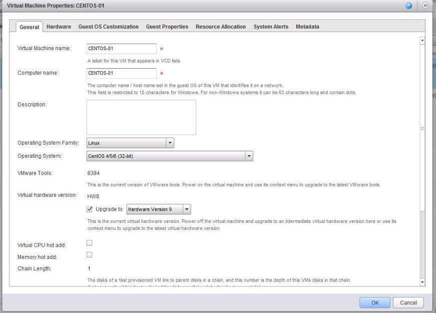

# Availability of Virtual Hardware version 11

## Q. What does Virtual Hardware v11 provide?

Virtual Hardware v11 enables UKCloud to support increased CPU limits and memory, but primarily it introduces new guest OS support as follows:

Debian 8.*x*
Solaris 11.2
Asanux 4 SP4
Ubuntu 12.04.5/14.04.1
Oracle Linux 7
FreeBSD 9.3
MAC OSX 10.10
Windows 2016

## Q. When do these changes take effect?

UKCloud has already enabled these upgrades internally on our UKCloud for VMware platform.

The newer virtual hardware version is already available in regions 5 and 6. Regions 1, 2, 7 and 8 will be available for customers by the end of Q3 2018. Any new VMs will, by default, be created with the updated virtual hardware version; clients are able to specifically select an earlier hardware version at the point of VM creation. Any existing VMs and templates will continue to use their currently configured virtual hardware version until such time as customers select to change this. Any clones/copies of VMs or templates will retain the same virtual hardware version as the source image.

Prior to upgrading the Virtual Hardware version the following should be noted:

- You cannot downgrade the hardware version of the virtual machines in a vApp

- The vApp/VMs must be stopped and its virtual machines must have the latest version of VMware Tools installed.

## Q. How do I manually upgrade the Virtual Hardware version of my VM?

1. Log into the UKCloud Portal and access vCloud Director
2. Click My Cloud.
3. In the left pane, click VMs.
4. Select a virtual machine, right-click, and select Upgrade Virtual Hardware Version.
5. Click Yes.

## Q. Are there precautions I need to be aware of?

The update of CPU features may result in some operating systems being reconfigured on their next reboot. We advise that customers monitor the first reboot of any VMs to ensure any OS configuration changes apply correctly.

## Feedback

If you have any comments on this document or any other aspect of your UKCloud experience, send them to <products@ukcloud.com>.