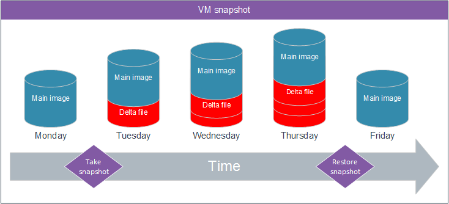
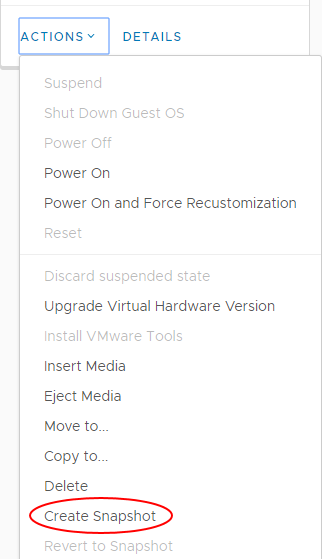

# Virtual machine data recovery options

## Introduction

There are three methods of creating a recovery point for your virtual machines (VMs):

- VM snapshot - provides the ability to rollback or recover from a change. We recommend that snapshots on a single VM do not span more than 14 days for performance reasons elaborated on below.

- VM copy - creates a master image to clone additional VMs from an existing VM.

- VM backup - provides disaster recovery from file corruption or deletion.

Each of these methods is discussed below to ensure that you are able to backup and recover your data in the most efficient and appropriate way.

## VM snapshot

When you create a VM snapshot, you grab a VM and all its data and configuration at a specific point in time (a snapshot). This is achieved by locking the main image of the VM, writing all subsequent updates, creations or deletions to a separate file (a delta) outside of your main image.

### Use case

When planning to deploy a kernel upgrade in Linux, take a snapshot prior to performing the upgrade. When you have applied and successfully tested the upgrade, you should remove the snapshot. If the upgrade is not successful or does not pass the quality check, you can simply rollback the changes by reverting to the snapshot.

### Pros

You are able to complete this task autonomously, without intervention by UKCloud. You can create a temporary recovery point while the VM is still running and then quickly rollback from any changes or updates made to the VM, should undesirable outcomes occur (for example, during a Windows Update).

### Cons

You can create only one snapshot for each VM, with each subsequent snapshot overwriting the previous one. You should use snapshots only as a temporary solution, as the longer the snapshot is running, the more changes will be lost should the snapshot be restored. In addition, due to the way that snapshots capture all changes to a separate file, storage costs will increase as a result of having to store both the original master VM image and you may also encounter a negative impact to the overall performance of the VM.

### How to create a VM snapshot

In the card for the VM that you want to create a snapshot for, select **Actions** then **Create Snapshot**.

## VM copy

When you copy a VM, you create an exact replica of the VM in either the same vApp or a different vApp.

### Use case

When creating a web application that can scale across multiple VMs of the same configuration, you can build an image to the required specification and then copy that VM to create a master image (gold build). When required, you can deploy subsequent VMs from this gold build in a consistent fashion, enabling swift scaling of your environment.

### Pros

You can easily create a gold build of VMs, thereby creating one image that you can then use to create additional VMs in a controlled and consistent fashion, without having to build each VM completely from scratch.

### Cons

You must power down the VM prior to taking a copy. Each additional copy will consume as much storage as the original and consume additional memory and CPU cycles while the VMs are running.

### How to create a VM copy

In the card for the VM that you want to copy, select **Actions** then **Copy to**.

## VM backup

You should view backup as a disaster recovery mechanism, whereby you can restore entire environments or individual files in the event of the original becoming unavailable as a result of corruption or accidental deletion.

You can add any VM to the automated snapshot backup schedule so that it is automatically backed up on a daily basis. You can choose to retain snapshot backups for either 14 or 28 days. Data is backed up at the hypervisor level and provides a crash‑consistent image.

### Use case

If you accidentally delete or amend a file that should not be modified, you can restore the file in question from backup by raising a Service Request via the [My Calls](https://portal.skyscapecloud.com/support/ivanti) section of the UKCloud Portal.

### Pros

You gain peace of mind that data is backed up nightly for a rolling period of 14 or 28 days without any manual intervention.

### Cons

Time taken for a restoration request to be completed (dependent on the amount of data to be restored).

### How to add a VM to the automated snapshot backup schedule

For information about how to add a VM to the automated backup schedule, see [*How to manage snapshot protection for your VMs*](vmw-how-manage-snapshot-protection.md).

## Feedback

If you find an issue with this article, click **Improve this Doc** to suggest a change. If you have an idea for how we could improve any of our services, visit the [Ideas](https://community.ukcloud.com/ideas) section of the [UKCloud Community](https://community.ukcloud.com).
