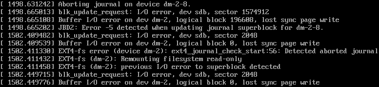

# Identifying if a VM is running in read-only mode

## Overview

If the UKCloud platform encounters storage issues, powered-on virtual machines (VMs) may start to run with their file systems in read-only mode. The way you check for this depends on the operating system (OS) used by the VM.

## Windows guest OS

### How to confirm if a Windows VM is in read-only mode

To confirm if a Windows VM is in read-only mode you can try to create a new file on the affected drive of the system. If you're unable to do so, the VM may be in read-only mode.

The Windows Event Viewer (`eventvwr.exe`) may display the following in the system log:

- Severity Level : Error, Source : Disk, EventID : 7

- Severity Level : Warning, Source : Disk, EventID :51

### How to resolve a read-only Windows VM

Once UKCloud has confirmed that the underlying issue has been resolved, Windows can often recover the file system. However, in cases where this is not possible, you will need to restart the VM.

## Linux guest OS

### How to confirm if a Linux VM is in read-only mode

Often a Linux VM will report an error when forced to operate in read-only mode. To confirm that a Linux-based VM is running in read-only mode, you can perform a touch command to create or edit a file on the affected file system or mount point. If it fails, this means that the VM may be in read-only mode.

The console of the VM, accessible via VMware Cloud Director, may show messages similar to the following:

### How to resolve a read-only Linux VM

Once UKCloud has confirmed that the underlying issue has been resolved, you'll need to restart the VM to restore normal service.

## Edge gateway or vApp network edge

### How to confirm if an edge is in read-only mode

Edges will continue to operate normally when in read-only mode. However, you'll be unable to make any configuration changes to the edge. You can confirm this by trying to add a firewall rule.

### How to resolve a read-only edge

Once UKCloud has confirmed that the underlying issue has been resolved, you'll need to redeploy the edge or vApp network edge.

## Feedback

If you find a problem with this article, click **Improve this Doc** to make the change yourself or raise an [issue](https://github.com/UKCloud/documentation/issues) in GitHub. If you have an idea for how we could improve any of our services, send an email to <feedback@ukcloud.com>.
