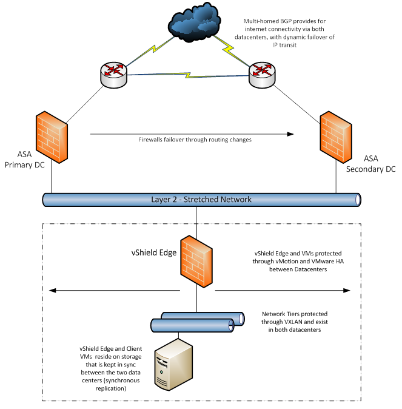

# Synchronous Protection Service Scope

## About this document

This Service Scope explains what is and isn't included in the scope of the UKCloud for VMware Synchronous Protection service option.

Synchronous Protection is one of a variety of on‑platform protection options available from UKCloud. Use this service scope to understand what Synchronous Protection offers and whether it will meet your own recovery point objectives (RPO) and recovery time objectives (RTO).

> [!NOTE]
> Synchronous Protection is no longer available as a protection option for UKCloud for VMware. UKCloud offer two alternative data protection solutions: [Journaling Protection (Zerto)](vmw-sco-journaling-protection.md) and [Snapshot Protection](vmw-sco-snapshot-protection.md). Contact your Service Delivery Manager for more information.
>
> We will continue to provide support to customers who previously added Synchronous Protection to their environment, although we would encourage considering using Journaling Protection instead.

## About Synchronous Protection

The UKCloud for VMware Synchronous Protection service option is designed to offer geographical protection of your live environments across both of our sites (Farnborough and Corsham; 60 miles apart). To achieve this, we utilise synchronous replication between sites to ensure that any changes made to your environment are committed to arrays in both sites before the write is confirmed as being complete to the VM OS.

Synchronous Protection provides a replica of data (for any data written, and flushed to disk) and then enables the ability to migrate your VMs between the sites while they are running, offering a greater level of protection for live environments.

Your service is only ever presented out of one of these sites (a VM exists in only one location at a time), but a synchronous copy between the sites ensures that an exact copy is stored in the second site, which can be brought online, with zero data loss, in the event of a failure.

## Synchronous Protection availability

Synchronous Protection is currently available in regions 1, 2, 7 and 8.

## Design

Synchronous Protection is an active‑passive solution. The solution offers failover to a second UK site, however your VM will be active in only one site at any given time.

Customers relying on a single virtual firewall in their primary site should be aware that in some circumstances, such as a failure of the inter-site network, or of the customer's primary virtual firewall, access to their solution will be lost. If you require an active‑active solution, you can build across both sites and design in load balancing. Contact your Account Manager if you want to investigate this option.

If a failure affects several VMs, they will be restarted in no particular order. We do not offer any controls to programmatically manage this - in most scenarios, the restart is automatic. If you need your VMs or vApps to be started in a particular order, we recommend that you restart them manually.

Within each site we've architected a platform with a minimum of N+1 resilience, including routers and switches.

## RPO and RTO

Synchronous Protection provides a disaster recovery service with an RPO of almost 0 seconds. The RTO is variable and will be influenced by factors such as your application design and the ability to failover networks.

For clarity, this product does not use asynchronous replication technologies. The recovery point is the last write to disk with no historical recovery points (there is no ability to "roll back" to a previous version). If asynchronous replication with historical recovery points is required, consider [Journaling Protection](vmw-sco-journaling-protection.md).

## Unplanned failover process

We monitor the underlying physical infrastructure including the blades, routers and switches. There are a variety of scenarios that can trigger an unplanned failover event.

In the majority of scenarios, failover activities are automatic. In scenarios such as multiple component failure, including loss of redundancy, in the majority of cases your VMs and edge gateway instances will be automatically brought online, either on an alternative physical device in the same site or in the second site. This is dependent on available resources.

However, other scenarios can result in a full or partial failover, and in these cases we'll need to react differently.

## Manual failover

In some scenarios a full automated failover will not be possible. In each case the remedial actions may be different, and we have a variety of tools, such as VMware vMotion and VMware Storage vMotion, that we can utilise to return your VMs to service.

In the case that a site failover is not automatically completed, we use the entry criteria below to ascertain if there is a need for a manual failover.

If a need is established, we review the technical considerations to ensure and validate the decision for a manual failover is both safe and appropriate.

Entry criteria | Yes/No
---------------|-------
Incident is site specific |
Outlook for recovery more than two hours |

Technical considerations | Yes/No
-------------------------|-------
Control plane availability |
Storage consistency |
VM to VM network availability |
External network availability |

### Entry criteria explained

Are the service conditions met to confirm the need for a manual failover?

- **Incident is site specific** - An incident must be site specific (either Farnborough or Corsham). In the unlikely event the incident effects both sites, a manual failover will be unlikely to resolve the issue so will not be considered.

- **Outlook for recovery more than two hours** - In the event that a failover is not automatic, we'll conduct an initial technical investigation to identify the cause of the failure. This technical investigation is time‑boxed to two hours (including time to recover the service).

If at any point in this assessment the outlook for recovery of normal service is deemed unlikely by the end of the time box, the issue will undergo technical consideration for a manual failover.

### Technical considerations explained

If a failure meets the entry criteria described in the section above, we'll assess if there are any technical reasons preventing the initialisation of a manual failover.

If these technical conditions are not met, a manual failover will not be attempted. But we'll continue to work to bring your VMs back online in the shortest possible timeframe.

At any point in the technical assessment, we may return to considering a manual failover.

- **Control plane availability** - The control plane is defined as the platform for managing the environment (by us or by you). If the control plane is wholly unavailable, then our ability to execute a failover and manage the infrastructure will be compromised. Therefore, a failover would not be immediately possible.

- **Storage consistency** - This check is to ensure the data is available and consistent. Geo‑resilient storage is distributed evenly across a SAN spanning both UKCloud sites and is managed by vPlex. If the underlying SAN becomes compromised, VMs may lose connectivity with their data store. If the data is not consistent, a failover event will not be initiated.

- **VM to VM network availability** - This check is to ensure inter‑VM communication is functional and consistent.

  - If a physical appliance such as a host fails, VMs may be relocated to restore connectivity and is unlikely to require a full site failover.

  - If a virtual appliance such as a vShield Edge fails, failover may not resolve the issue and would potentially deviate technical resources from the recovery of the incident.

**External network availability** - This check is to ensure external communication to the wider community is functional and consistent. This is specific to UKCloud connectivity to internet or PSN services. Each site has independent connectivity in addition to cross‑site connections. The failover decision will be dependent on the severity of the outage experienced; if outbound connectivity to the required networks is not available on the second site a failover event will not be initiated.

## Example scenarios and suitability for site failover

The following are example Major Incidents that would trigger the question on whether to perform a failover.

Incident | Failover action | Mitigation to minimise impact
---------|-----------------|------------------------------
DDoS attack | None | Always-on hybrid DDoS solution
Site fire/power outage | Automatic or manual | Secure site, fire suppression, standby generators, UPS, offsite backups
Network connectivity between sites | None | Multiple DCI links - geographically diverse, multiple providers
Compute: minor component failure | Automatic | Minimum of N+1 resilience, chassis and blades
Compute: major component failure | Automatic or manual | Spare capacity/modular design/dual site
Network hardware failure | Automatic or manual | Minimum of N+1 resilience, routers and switches
Split site (OTV networking and management networking) | Automatic or manual | Multiple DCI links -- geographically diverse

## Failover timing

The amount of time it takes for your services to failover will depend on the failure scenario, but generally the failover will take as long as the VM needs to reboot plus a small amount of additional time to invoke the failover - about 45 seconds. Some scenarios, such as a "split brain", can take longer, leading to an outage of two hours.

## Alerting and reporting

A failover is a rare event and will normally be a result of a Major Incident. In these cases, we communicate to the wider community via the appropriate Portal and, if you have already reported an incident, via the ticket or by phone.

You can also receive alerts via email subscription or using the [Service Status page.](https://status.ukcloud.com/)

We'll contact you after a failover to inform you that our actions are complete.

We do not currently provide alerts when a VM is moved to a different site. However, you can check the location of your VMs. For more information, see [*How to use VM location in vCloud Director*](vmw-how-use-vm-location.md).

## Networking

For internet‑bound traffic, we manage an autonomous Border Gate Protocol (BGP) service that enables us to intelligently redirect traffic without affecting your IP address allocation.

The resilience of the external connectivity into the Elevated OFFICIAL security domain depends upon, and is generally provided by, the access network. Behind the router layer, we have designed a network that stretches between our two sites. This allows for network connectivity (if installed in one site) to remain if your virtual firewall and UKCloud's physical firewall are in separate and alternative sites.

We advise that you consider how additional services such as Cloud Enablement and leased lines will be affected in a disaster recovery scenario, as this falls outside the Synchronous Protection offering.

UKCloud's firewalls are protected within each site, with the failover between the sites performed via an orchestrated process. We achieve this through a sequence of routing changes within our network (see the figure below).

## Failover testing

If you want to test your own service, you can test the Synchronous Protection failover function by requesting a Test Scenario. Test Scenarios are designed to test and understand how your applications might react in a failover when the underlying physical hosts have failed (simulated in the scenario) or when the VMs have been migrated in a live state.

A Test Scenario is not a customisable feature of UKCloud for VMware.

### Test Scenario limitations

- UKCloud will complete a Test Scenario for a maximum of one VDC (up to 10 VMs). This provides you with an experience similar to a live failover scenario.

- Test Scenarios take place only during office hours (0900 - 1730).

- The failover will be deemed a success by UKCloud when we can identify that the VMs are running in the second UKCloud site, using our own monitors and tools.

- Backups cannot take place during a failover.

- We will not failover the connectivity and physical firewall during a Test Scenario. You will experience a network latency of a few milliseconds through this firewall.

- UKCloud do not, at present, offer a "hard failover" test where a physical host is switched off to simulate a hardware fail event.

### Test Scenario options

**Option 1. Dynamically moving your VMs between the two sites:** We'll dynamically move your VMs between our sites while the VMs remain online. There will be increased network latency between client VMs that are running in the different sites (around 4 -- 4.5ms).

**Option 2. Restarting your VMs between sites:** Your VMs can be shut down and restarted in the secondary site. If the shutdown is non-graceful (power‑off as opposed to a guest OS shutdown), this simulates the effect of a physical server outage from an individual VM perspective. This is the equivalent of a total site failure.

As our platform is multi-tenanted, we will not replicate a physical host failure to invoke a disaster recovery scenario as this could affect other customers.

The failover exercise will be conducted and failed back to the originating site during office hours (0900 - 1730).

### Failover testing outputs

Failover test are generally seamless for customers, making it difficult for you to gauge that it has taken place. To provide assurance that the test was successful, we'll produce a report for each customer that identifies the following:

- A sanitised (removing ESX host names) report of the ESX servers that the VMs are located on during the period of the failover test

- Comments and observations

## Requesting a Test Scenario

To request a Test Scenario, you need to raise a Service Request within the [My Calls](https://portal.skyscapecloud.com/support/ivanti) section of the UKCloud Portal indicating that you want to complete the test and provide the following details:

- VDC name

- VM names (up to 10) you want to failover

- Start and end time

- Any other requirements

Note that the start and end times must be within office hours, which are 0900 - 1730.

When we receive the request, we'll respond either accepting or rejecting it. Note that we require a minimum of five working days notice prior to the request.

If we accept your request, we'll schedule the work to start at the time you specified as long as it is within office hours (0900 - 1730).

## Failover testing charges

We generally allow a test to be conducted during office hours (0900 - 1730) with a charge (based on the [*SFIA Rate Card*](https://ukcloud.com/wp-content/uploads/2019/06/ukc-gen-759-ukcloud-g-cloud-11-standard-rate-card-and-definitions.pdf) - level 3 Apply). Longer testing periods will need to be approved by UKCloud.

## Feedback

If you find an issue with this article, click **Improve this Doc** to suggest a change. If you have an idea for how we could improve any of our services, visit the [Ideas](https://community.ukcloud.com/ideas) section of the [UKCloud Community](https://community.ukcloud.com).
