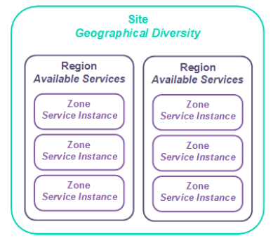

# UKCloud for VMware Service Scope

## About this document

This document describes the boundaries of the UKCloud for VMware service, along with the division of responsibilities between UKCloud and the customer, to facilitate the provisioning and ongoing use of the service.

## About UKCloud for VMware

The UKCloud for VMware service provides a secure, scalable and cost-effective platform for hosting virtual machines (VMs) of various sizes with different service levels.

You can use the platform to build new services quickly and securely; and migrate, augment or transform existing applications. The platform is immediately available so you can provision and scale VMs in minutes.

## Service architecture

Your UKCloud service architecture is as follows:

**Company.** Your contract with UKCloud is associated with a company, which provides a single owner for the contract, regardless of how many accounts are created.

**Account.** We use accounts to separate financial ownership. An account could represent an organisation, a customer contract, or a specific project. An account can also have several UKCloud services associated with it, such as UKCloud for VMware, Cloud Storage and UKCloud for OpenStack. You can also use accounts to separate users based on access requirements or permissions.

**Organisation (vOrg).** This represents your UKCloud for VMware service inside vCloud Director and on the UKCloud Portal. There is a 1:1 mapping of service to vOrg.

**Virtual data centre (VDC).** A VDC is where you define your workload type and build your virtual machines (VMs). You can create VDCs through the UKCloud Portal or the Portal API.

## Service options

You can build a tailored solution to meet your requirements by mixing and matching service options. The choice does not lock you to one service or size, allowing you to scale resources up or down as your requirements change.

**Workload type.**

Workload type | Resource allocation   | Automated Rebalancing
--------------|-----------------------|----------------------
ESSENTIAL     | Contended             | Configured to meet requested performance
POWER         | Uncontended (CPU/GiB) | Pre-emptively optimises performance and availability
PRIORITY      | Uncontended (CPU/GiB) | Configured to reduce workload movement around the platform, reducing workload disruption

**VM size.** There are 11 T-shirt sizes available for VMs, with varying vCPU and RAM configurations, ranging from 1vCPU and 512MiB RAM to 12vCPUs and 128GiB RAM. You can change the size of your VMs after creation through vCloud Director.

Full details of the available service options are outlined in the [*Service Definition*](vmw-sd.md).

## Storage options

All workloads (except micro) include 60GiB of Tier 2 storage for free, all storage is persistent and resilient to local hardware failures. Micro sized VMs include 10GiB of Tier 2 storage.

Additional storage can be purchased to support your application. Multiple storage options can be used to support different aspects of the application.

- **Tier 1.** Our most performant storage for workloads requiring consistently higher disk throughput.

- **Tier 2.** Persistent block storage with typical performance characteristics for use by production applications or storage.

## Storage policies

We provide you with access to two storage policies: tier 1 and tier 2.

Both policies have a 10TiB quota of storage to allow for rapid expansion of services as required.

- We do not guarantee storage performance, as it can be affected by many factors

- We do not provide IOPs figures for our storage offerings

- Workloads can use multiple storage profiles

- Micro sized VMs have a fixed allocation of 10GiB of Tier 2 storage which cannot be increased

## Protection

Customers have a range of automated, on-platform protection options to choose from for their environments:

**Catalogue and template-based recovery.** All customers have access to catalogue and template-based recovery as standard. This is a configuration management solution that can re-provision stateless servers to a new VM when required, using standard, and catalogue-based VM templates.

**Snapshot Protection.** 14-day or 28-day snapshot policies available. Data protected by the snapshot has an RPO of 24 hours, with RTO determined by the time taken to restore the VM after the Service Request is raised. See the [*Snapshot Protection Service Scope*](vmw-sco-snapshot-protection.md) for full details.

**Journaling Protection.** A non-invasive, self-service disaster recovery solution with configurable recovery points, providing near real-time data protection. The standard journaling profile provides a target RPO of 5 minutes and a journal history of 2, 7, 14 or 28 days. The [*Journaling Protection Service Scope*](vmw-sco-journaling-protection.md) covers the full details of this protection option.

## Advanced management

This bundle includes Distributed Firewall (DFW), Distributed Logical Router (DLR), Layer 2 VPN and vROPs Tenant Monitoring and Metrics.

> [!NOTE]
> These services may not be available in all regions and zones.

## Service availability

UKCloud platform availability is based on the workload type you purchase.

The service level agreement (SLA) for POWER workloads guarantees 99.99% availability.

ESSENTIAL and PRIORITY workload SLAs guarantee 99.95% availability.

You are entitled to claim Service Credits for outages to services that take you out of SLA. For more about how we calculate SLAs, see the [*SLA Definition*](../other/other-ref-sla-definition.md).

## Service background

- We maintain the standard VM template sizes that control allocation of CPU and resources.

- VMs are fully provisioned.

- The system is configured to automatically balance resources, so your VMs may vMotion between physical hosts. PRIORITY workloads are configured to reduce movement around the platform.

- To maintain performance across the platform, UKCloud can perform movements/migrations of VMs, vApps or storage within the infrastructure assigned to a service.

- We actively capacity-manage the cloud platform to ensure you have access to the resources you request.

    The UKCloud platform is designed using sites, regions and zones. The relationship between them is shown below:

    

- You can specify Farnborough or Corsham as the site where you would like to have your service provisioned. We will try to accommodate requests and will advise you if we are unable do so.

- We control the deployed versions of technology on the platform. This covers internal platform-supporting technologies, and any technology versions available to you.

  - Internally this includes, but isn't limited to, the vSphere and ESX versions, and the hardware version of the platform.

  - Externally this includes the available versions of the edge gateway and vCloud Director.

- Promiscuous mode is disabled.

- You can set affinity or anti-affinity rules through vCloud Director so that VMs do, or do not, run on the same physical host.

- You can make additional configurations inside a VM (such as acting as a secondary hypervisor or implementing third-party software technologies). We do not support customer implementations inside a VM.

## Operating systems

**Licensing.** We can provide:

- OS licensing through the SPLA and academic frameworks for Microsoft

- Red Hat Enterprise Linux licensing

For the latest available licences, please check the [UKCloud Pricing Guide](https://ukcloud.com/pricing-guide).

You can bring your own licensing for Red Hat and certain Microsoft application licensing under Microsoft Mobility using software assurance. If you're providing your own licensing, you should inform UKCloud by raising a Service Request via the [My Calls](https://portal.skyscapecloud.com/support/ivanti) section of the UKCloud Portal for a retrospective discount.

For non-UKCloud issued software, you must obey the licensing requirements of the software provider. This includes being aware of any constraints around using the software in a virtualised environment.

**VM server images.** We provide base VM images for the operating systems (OS) for which we provide licensing. You can access these from vCloud Director.

You can use your own images for non-Windows and RHEL services, where licensing stipulates that to use the VM on our platform it must be licensed (and reported back to the software vendor) by UKCloud.

**Update services.** We make update repositories available for all software for which we provide licensing. We don't provide software update facilities for non-UKCloud licensed software.

**Anti-virus.** We do not provide anti-virus software as part of the service.

## Networks

A full overview of the connectivity options and network architecture is available in [*Understanding connectivity options in UKCloud for VMware*](vmw-ref-connectivity-options.md).

We manage the physical firewalls that face public and secure networks.

**Internet-facing solutions** have 2 usable public IP addresses. You can ask for additional public IP addresses by raising a Service Request via the [My Calls](https://portal.skyscapecloud.com/support/ivanti) section of the UKCloud Portal. We reserve the right to decline the request if you have spare capacity in your existing deployment.

**PSN-facing solutions.** You should raise a Service Request via the [My Calls](https://portal.skyscapecloud.com/support/ivanti) section of the UKCloud Portal to be assigned your IP address. Contended bandwidth (uncapped).

**Janet and HSCN solutions** have one usable IP address. You can request additional IP addresses by raising a Service Request via the [My Calls](https://portal.skyscapecloud.com/support/ivanti) section of the UKCloud Portal.

From a customer management experience, you manage all your connectivity rules, such as firewall, IPsec VPN and NAT functionality, through your edge gateway, using either the UKCloud Portal GUI or API.

## Edge gateway (previously vShield Edge)

- By default, we assign one edge gateway per connectivity type.

- For VDCs you create through the Portal API, you are responsible for creating your own edge gateway.

- You can have up to nine Org VDC networks per edge gateway.

**vApp edge.** vApp networks allow you to create smaller networks within individual vApps which have a vApp Edge, similar to the edge gateway on your VDC. Although a vApp Edge isn't as feature rich as an edge gateway, it lets you create firewall and NAT rules to separate your VDC networks from your vApp virtual machines (VMs). See [*vApp networking*](vmw-how-create-vapp-network.md) for configuration details.

**Site-to-site IPsec VPN.** You can create IPsec VPN tunnels to connect the services located behind different NFTs. You can also externally configure IPsec VPNs. There is a limit of 64 tunnels per edge gateway.

**SSL VPN.** You can create SSL VPN tunnels that terminate on the edge gateway, providing up to 50 concurrent users with access to that VDC. We recommend you use this for occasional administrative purposes, rather
than as part of a regular end-user design.

**Load balancing.** The edge gateway acts as a basic layer 3 load balancer, including features such as session persistence and health checks. If you need more advanced load balancing, you should consider a third-party product.

## Bring Your Own Firewall

Bring Your Own Firewall allows you to customise your networking infrastructure by installing your own virtual firewall appliance in place of the edge gateway included as standard.

We don't offer a rebate for unused edges. If you choose to bring your own firewall, you are completely responsible for the deployment, configuration and management of that firewall.

If you change from a UKCloud-provided firewall to your own firewall, we will redeploy your firewall on to a dedicated network and you will need to migrate your environment to that network.

Full customer and UKCloud responsibilities can be found in the [*Bring Your Own Firewall Service Scope*](vmw-sco-byof.md).

## Protective monitoring

We have implemented GPG 13-aligned Protective Monitoring across the Assured and Elevated platforms at the hypervisor level and below.

We don't provide Protective Monitoring services above the hypervisor (for example, for your VM) - it is your responsibility to act at this level.

In line with UKCloud's SISP, we provide notification of customer-impacting security incidents. It is your responsibility to report similar incidents to us.

## Platform management

Users can access, manage and view the UKCloud for VMware service, accessing only those features allowed by their role, in any of the following ways:

- **vCloud Director API.** Enables the programmatic creation and management of VMs inside the platform.

- **vCloud Director graphical UI.** Provides a graphical interface to access the vCloud Director environment (depending on assigned permissions).

- **UKCloud Portal.** Enables the creation of compute services and subsequently VDCs and edge gateways. The Portal also includes an overview of actual and estimated spend, along with service configuration information. Access to incident and request management is also possible through the Portal.

You cannot access the underlying infrastructure. This includes (but isn't limited to) the hardware and the vSphere environment.

## Service migration

You can move your workloads from a local VMware or Hyper-V powered environment onto the UKCloud platform using Migration to the Cloud (powered by Zerto). You can find pricing information in the [UKCloud Pricing Guide](https://ukcloud.com/pricing-guide).

Customers are free to migrate their workloads. You can also request a migration through a Service Request via the [My Calls](https://portal.skyscapecloud.com/support/ivanti) section of the UKCloud Portal. Migrations may be between:

- Services (for example, ESSENTIAL to POWER)

- UKCloud sites or zones

- The Assured and Elevated security domains

## Service reporting

**Visibility.** Maintenance notifications and Service Status reports are delivered through the Portal.

**Billing.** We provide you with monthly bills covering your monthly spend.

## Customer service

**Cloud Architect.** UKCloud Cloud Architects support you during the design of solutions for the cloud platform. UKCloud Cloud Architects are ideally placed to help reconcile your requirements with the UKCloud platform. We recommend engagement with a Cloud Architect when implementing complex solutions, such as those using HybridConnect or a Walled Garden.

**Service Delivery Manager (SDM).** An assigned point of contact who will provide any assistance you require during your use of the service, including onboarding, service reviews and incident reporting and escalation.

**Support Desk.** After the initial on-boarding and design phase, you can utilise the standard UKCloud support entitlement, which is documented in the [*Customer Engagement Factsheet*](https://ukcloud.com/wp-content/uploads/2018/08/ukcloud-factsheet-customer-care.pdf).

## Customer responsibilities

- You are responsible for assessing whether the UKCloud platform can support the various requirements of your application.

- The control and management of access and responsibilities for end users including appropriate connectivity, security and accreditation if required.

- If access is required over government secure networks (HSCN, Janet, RLI or PSN), the customer is responsible for adhering to the relevant Code of Connection (CoCo) and for providing evidence of their CoCo to UKCloud upon request. UKCloud is unable to provide access to secure networks where such evidence has not been provided by the customer.

- Management and administration of layers above the hypervisor (OS patching, application performance monitoring, user administration).

- The customer is also responsible for ensuring only lawful data that supports the UK public sector is stored and processed by applications on this environment, and that they fully comply with the UKCloud Security Operating Procedures (SyOPs) and other information assurance requirements as specified in the UKCloud System Interconnect and Security Policy (SISP) and associated accreditation documentation sets.

## Service provisioning

Within 4 hours of accepting an order (shorter deployment times are typically achieved and can be prioritised upon request), UKCloud will create the customer's Primary Administrator account and send a Welcome Pack which includes the URL for the UKCloud Customer Portal, and the getting started guide. Customers can self-provision UKCloud for VMware services via the UKCloud Portal or the Portal API.

UKCloud has created several videos, help guides, manuals and FAQs to help train and instruct users so that they are up and running quickly and easily. These are available within the [Knowledge Centre](https://docs.ukcloud.com/).

UKCloud also has a large ecosystem of partners who can deliver additional services, such as support and professional services. UKCloud would be pleased to introduce you to the right partner to suit your needs.

## Service constraints

UKCloud will adhere to the following in terms of maintenance windows:

"Planned Maintenance" means any pre-planned disruptive maintenance to any of the infrastructure relating to the service. Planned Maintenance activity may result in periods of degradation or loss of availability depending on the nature of the activity required. In such cases, UKCloud shall provide affected customers with at least fourteen (14) days' notice of the Planned Maintenance.

If during Planned Maintenance there is a loss of availability outside the scope described in the planned maintenance notification to the service, an SLA event will be triggered. For ESSENTIAL and POWER services this event will count in SLA calculations. For VMs running as a PRIORITY configuration, this time will be excluded from the availability calculation.

"Emergency Maintenance" means any urgent maintenance required to prevent or mitigate against any event compromising the infrastructure relating to the service. Whenever possible, UKCloud shall:

a)  provide affected customers with at least six (6) hours' advance notice and

b)  carry out the emergency maintenance between the hours of 00:00 and 06:00 (UK local time) Monday to Friday or between the hours of Saturday 00:00 to 06:00 (UK local time) on Monday, (including bank holidays) unless there is an identified and demonstrable immediate risk to customer environment(s). Emergency Maintenance may result in periods of degradation or loss of availability depending on the nature of the activity required.

If during Emergency Maintenance there is a loss of availability to the service, an SLA event will be triggered. This time will be excluded from the availability calculation.

## Supporting documents and resources

The following documents contain more information about UKCloud for VMware and the service options:

- [*UKCloud for VMware Service Definition*](vmw-sd.md)

- [*UKCloud for VMware FAQ*](vmw-faq.md)

- [*Getting Started Guide for UKCloud for VMware*](vmw-gs.md)

- [*Snapshot Protection Service Scope*](vmw-sco-snapshot-protection.md)

- [*Journaling Protection Service Scope*](vmw-sco-journaling-protection.md)

- [*Bring Your Own Firewall Service Scope*](vmw-sco-byof.md)

- [*Understanding connectivity options in UKCloud for VMware*](vmw-ref-connectivity-options.md)

- [*UKCloud Terms and Conditions*](../other/other-ref-terms-and-conditions.md)

- [*SLA Definition*](../other/other-ref-sla-definition.md)

## Feedback

If you find a problem with this article, click **Improve this Doc** to make the change yourself or raise an [issue](https://github.com/UKCloud/documentation/issues) in GitHub. If you have an idea for how we could improve any of our services, send an email to <feedback@ukcloud.com>.
