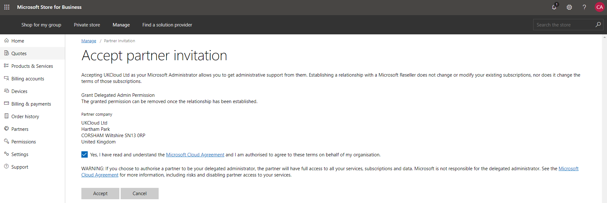

# UKCloud for Microsoft Azure Onboarding Guide

## Overview

UKCloud for Microsoft Azure provides you with new options to harness Microsoft Azure alongside other cloud platforms, including Oracle, VMware and OpenStack. This gives you the flexibility to accommodate diverse workloads within a low latency, accredited platform with native connectivity to non-cloud workloads in Crown Hosting and the networks that are vital to the public sector: from PSN Protected to HSCN and RLI.

This Onboarding guide provides help for getting your UKCloud for Microsoft Azure environment up and running.

## What is Azure Active Directory and why is it required for UKCloud for Microsoft Azure?

Azure Active Directory is Microsoft's cloud-based Directory and Identity Access Management Service. It provides Single Sign-On and core directory services via a high availability service with automated failover. <abbr title="Azure Active Directory"> AAD</abbr> provides the identity store for UKCloud for Microsoft Azure, supporting features such as two-factor authentication and role based access control.

> [!Note]
> If you do not have an existing Azure Active Directory, please provide a preferred domain name and administrator email address, and UKCloud will create an Azure Active Directory Domain (subject to availability) free of charge.

## How can I get started with UKCloud for Microsoft Azure?

# [I have an existing Azure Active Directory Domain](#tab/tabid-1)

If you have decided that UKCloud for Microsoft Azure is the right environment for you, please contact your CSM who will request the following information:

- Contact Email Address
- Azure Active Directory Domain
- Azure Active Directory Administrator Email Address

For example:

    Hi <CSM>

    Here are the details for our new UKCloud for Microsoft Azure environment as requested:

    Contact Email Address: onboardingukcloud3@ukcloud.com
    Azure Active Directory Domain: onboardingukcloud3csp.onmicrosoft.com
    AAD Administrator Email Address: admin@onboardingukcloud3csp.onmicrosoft.com

    Kind Regards,
    John Doe
    UKCloud

Once this information has been provided, UKCloud will proceed to set-up your new UKCloud for Microsoft Azure environment.

Shortly after submitting your details, you should receive an email asking for permission for UKCloud to be you Microsoft Cloud Solution Provider. An example of this email can be seen below:

Once you have received this, please click the "CSP Invitation URL" link and click to sign in:

After signing in you will be greeted with the following page. Please tick the checkbox and click "Authorize CSP", then contact your CSM so UKCloud can complete your onboarding process.

Subsequent to this, you should receive a welcome email from your CSM containing the details of your new UKCloud for Microsoft Azure environment.

# [I do not have an existing Azure Active Directory](#tab/tabid-2)

If you have decided that UKCloud for Microsoft Azure is the right environment for you, please contact your CSM who will request the following information:

- Contact Name
- Contact Email Address
- Contact Phone Number
- Billing Address
- Preferred Azure Active Directory Domain

For example:

    Hi <CSM>

    Here are the details for our new UKCloud for Microsoft Azure environment as requested:

    Contact Name: John Doe
    Contact Email Address: onboardingukcloud3@ukcloud.com
    Contact Phone Number: 01252 303300
    Address Line 1: Hartham Park
    Address City: Corsham
    Address County: Wiltshire
    Address Country: GB
    Address Post Code: SN13 0RP
    Preferred Azure Active Directory Domain: onboardingukcloud3csp.onmicrosoft.com

    Kind Regards,
    John Doe
    UKCloud

Once this information has been provided, UKCloud will proceed to set-up your new UKCloud for Microsoft Azure environment.

After providing the above details, you should receive a welcome email shortly from your CSM containing the details of your new UKCloud for Microsoft Azure environment.

***

## Feedback

If you have any comments on this document or any other aspect of your UKCloud experience, send them to <products@ukcloud.com>.